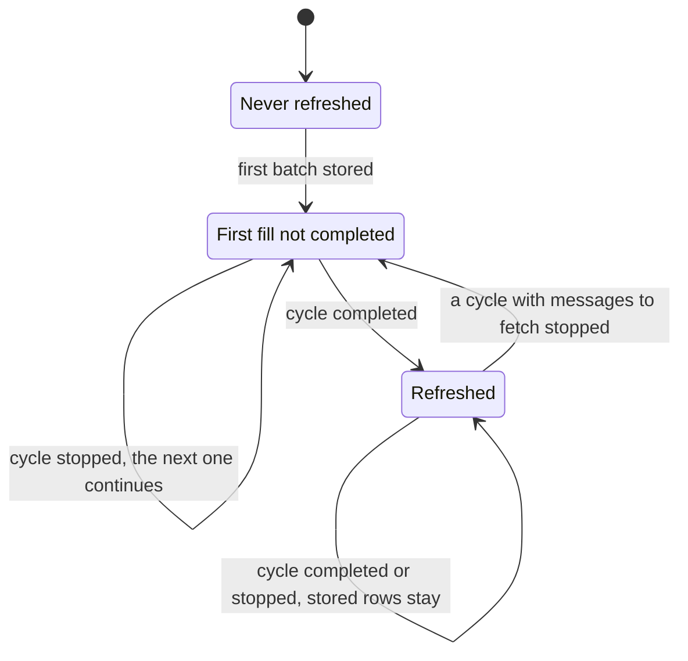

# Feature Specification: Synchronization

**Feature**: `009-synchronization`
**Created**: 2026-09-28
**Status**: Implemented on `claude/sync` on 2026-09-29, portion by portion
with the maintainer's review; FR-001, FR-002(a), FR-005 and FR-015(a)
amended on 2026-10-03 by [Read and star](../011-read-and-star/spec.md): a cycle also sends
the user's pending flag changes after its listing, the star is learned
beside the read state, and the user's pending change is the one other
way stored mail changes; the manual checks of the quickstart
passed on the installed build on 2026-09-30 (plan, Post-implementation).
FR-003, FR-009, FR-013 and FR-015(d) amended on 2026-09-30 by
[Message list](../010-message-list/spec.md): a batch carries each
message's preview, and the list's order and presentation are that
feature's. FR-009 amended on 2026-10-02 (one connection, faster; research
§14): the structures come with the rows, and a structure is refused on
its own only when asked for on its own. FR-001, FR-004, FR-005, FR-008,
FR-012 and FR-015(c), (e) amended on 2026-10-04 (the state pass, research
§15): a cycle learns the folder's state from the numbers its opening
returns and lists only what they say changed, with CONDSTORE where the
server announces it, and a cycle that fetched messages or sent commands
ends with a second pass; sized the same day (budget: at most 250
production lines and 400 test lines; no thread, timer or queue of its own,
no new dependency, no change to the IMAP library forks; four columns on
the folder); challenged the same day in fresh sessions (Clarifications
2026-10-04), approved and built the same day on branch `claude/state-pass`
(tasks T039–T045); its final passes are tasks T046–T047.
Approved on 2026-09-29 (tasks T001). Sized at the feature-start on
2026-09-28 (budget: at most 1 500 production lines, raised to 1 600 at
planning and to 2 000 during the implementation, and 1 500 test lines,
exceeded with the maintainer's consent; no thread, timer or queue of its
own, no new dependency, no change to the IMAP library forks), specified
and challenged the same day; the decisions are recorded under
Clarifications. The word *batch* replaced *portion* for a part of a
cycle's result on 2026-09-29, since *portion* also names a commit's share
of the work.
**Input**: Refresh Mailbox brings the whole selected folder into agreement
with its server instead of replacing it with its newest 100 messages: after
a refresh the stored folder is at least as new as the server's folder was
when the refresh began. New messages appear, read state follows the server,
messages gone from the server leave the folder, and nothing is removed
without proof. The first fill of a large folder shows its newest messages
first and continues after an interruption. Text is kept for messages
received in the last 30 days. The write direction, background runs and the
content cache follow later, under rules this feature sets.

**Scope**: This is the complete synchronization specification for Mailbag,
written for the target application with many accounts and many folders
each, on any server that follows the standards the application supports:
IMAP as RFC 3501 and RFC 9051 define it (UIDVALIDITY, UID FETCH), Gmail's
IMAP extensions, and Microsoft Graph's message delta queries. It owns how
one folder of one account is brought into agreement with its server: which
messages the folder holds, their list fields and read state, which of them
keep their text, how the server's changes are learned and proven, how a
first fill proceeds and resumes, the folder state this needs, and the rules
that every feature starting a cycle or changing messages MUST follow.

It does not own when, how often and on how many connections cycles run, nor
for which folders and accounts beyond the one the user refreshes
(background synchronization); which content is kept beyond the text rule of
FR-009 and for how long (the content cache, which takes that rule over); how
messages are presented, ordered and previewed (the message list); what a
folder is and how the folder list is obtained
([008](../008-folders/spec.md)). Whatever waits for a layer that does not
exist yet is marked deferred in FR-015 and gets no plan decisions, tasks or
code until that layer exists.

A *cycle* is one synchronization of one folder, from opening it on the
server to the folder being in agreement or the cycle stopping. A *batch*
is a part of a cycle's result that is stored whole, at once. A *state
pass* (since 2026-10-04) is the part of an IMAP cycle that learns the
folder's state from its server: the opening of the folder, the comparison
of the numbers the opening returns with those of the listing the store
reflects, the listing those numbers call for, and the storing of what it
proved with the numbers (FR-005).

## User Scenarios & Testing

### User Story 1 — The whole folder arrives, newest first (Priority: P1)

The user selects a folder that holds thousands of messages on its server
and chooses Refresh Mailbox. Within seconds the newest messages are listed,
the recent ones readable; older ones keep appearing below them while the
refresh runs, until every message of the folder is listed. The list scrolls
and opens messages the whole time. **Independent Test**: refresh a scripted
folder of 10 000 messages and watch the list: the first rows appear before
the refresh ends, every message is listed when it ends, and the window
never freezes.

**Acceptance Scenarios**:

1. **Given** a folder never refreshed, **when** the user refreshes it,
   **then** the newest messages are listed first and the rest follow in
   batches until the list holds every message of the folder.
2. **Given** a refresh is filling a folder, **when** the user opens a listed
   message of the last 30 days, **then** it opens with its text and stays
   open while rows keep arriving.
3. **Given** a folder of 10 000 messages is listed, **when** the user
   scrolls from the top to the bottom, **then** the window keeps up.
4. **Given** the folder is empty on its server, **when** a refresh
   completes, **then** the list says the folder is empty (007 FR-006).
5. **Given** a first fill runs for minutes, **when** another client marks
   a message read or deletes one during the fill, **then** the change is
   shown when the fill ends, without another refresh (FR-001, FR-005;
   since 2026-10-04).

---

### User Story 2 — Later refreshes bring only what changed (Priority: P1)

Mail keeps arriving, and the user reads and deletes mail in other clients.
The next Refresh Mailbox lists the new messages, shows the read state the
server now has, and removes the messages that left the folder. Messages
that did not change are not fetched again, so a refresh of a folder where
nothing changed is quick. The message the user has open stays open unless
it left the folder. **Independent Test**: after a completed refresh, change
the scripted server (add, delete, mark read and unread) and refresh again;
the list equals the server and only the new messages were fetched.

**Acceptance Scenarios**:

1. **Given** a synchronized folder, **when** new messages arrive on the
   server and the user refreshes, **then** they are listed and nothing else
   is fetched in full.
2. **Given** a synchronized folder, **when** another client marks messages
   read or unread and the user refreshes, **then** the list shows the new
   read state.
3. **Given** a synchronized folder, **when** another client deletes or moves
   messages away and the user refreshes, **then** they leave the list.
4. **Given** a message is open, **when** a refresh changes other rows,
   **then** the message stays open and the list keeps its position;
   **when** a refresh removes the open message, **then** the reader closes.
5. **Given** nothing changed on the server, **when** the user refreshes,
   **then** nothing on screen changes and the refresh ends quickly (SC-002).

---

### User Story 3 — Nothing disappears without proof (Priority: P1)

A server may cut an answer short, refuse a command or lose the connection.
Messages the store holds stay listed until the server proves they are gone.
**Independent Test**: a scripted server that cuts the folder's listing
short, one that refuses it, and one that drops the connection; no stored
message leaves the list, and the next complete refresh brings the folder
into agreement.

**Acceptance Scenarios**:

1. **Given** a synchronized folder, **when** the server's listing of the
   folder is cut short, refused or ended by a lost connection, **then** no
   stored message is removed and the refresh ends with the failure or
   notice 006 defines.
2. **Given** a Generic IMAP folder whose server renumbered its messages
   (a new UIDVALIDITY), **when** the user refreshes, **then** the folder is
   filled again from the server and no row keeps a number of the old
   numbering.
3. **Given** a Microsoft 365 folder whose saved position the service no
   longer accepts, **when** the user refreshes, **then** the stored rows
   stay while the folder is read again in full, and only messages that full
   reading did not list leave at its end.

---

### User Story 4 — An interrupted first fill continues (Priority: P2)

The network drops, the user quits, or the computer sleeps while a large
folder fills. What was stored stays listed and readable. The next Refresh
Mailbox continues where the fill stopped instead of starting over.
**Independent Test**: stop the scripted server after some batches of a
first fill; the stored rows stay; restart Mailbag and refresh; the fill
completes and messages stored before are not fetched again.

**Acceptance Scenarios**:

1. **Given** a first fill stopped after some batches, **when** the user
   looks at the folder, **then** the stored messages are listed and those
   of the last 30 days open with their text (FR-011 says what the list
   shows about the stop).
2. **Given** a first fill stopped, **when** the user refreshes, **then** the
   fill continues and messages already stored are not fetched again.

---

### User Story 5 — Recent mail can be read offline (Priority: P2)

After a refresh, every message of the folder received in the last 30 days
opens with its text, also without a network. Older messages are listed like
the others; opening one says that its text was not downloaded, and nothing
is fetched on opening. **Independent Test**: refresh a scripted folder with
old and recent messages; stop the server; the recent ones open with text,
the old ones say the text was not downloaded, and the scripted server
receives no request.

**Acceptance Scenarios**:

1. **Given** a completed refresh, **when** the user opens a message received
   in the last 30 days, **then** the reader shows its text, or the reason
   002 FR-004 gives for none.
2. **Given** a completed refresh, **when** the user opens an older message,
   **then** the reader says its text was not downloaded, and no request is
   made.

---

### User Story 6 — An account's mail follows Online Accounts (Priority: P3)

007 FR-007 and FR-008 hold for every batch. **Independent Test**:
through the scripted loader, remove the account after a batch is stored.

**Acceptance Scenarios**:

1. **Given** a folder is filling, **when** a complete Online Accounts answer
   no longer lists the account with Mail on, **then** the refresh stops, no
   batch is stored after that answer, and the account's mail is deleted;
   when Mail is on again, the next refresh fills the folder from nothing.

### Edge Cases

Each case below can happen with a supported server and changes what the
user sees without the rule named.

- **A message arrives during a refresh**: it is listed by the next refresh
  if the current one did not list it (FR-001); when the cycle runs a
  second state pass, it sees the arrival in the folder's numbers, lists
  it and leaves the folder not completed, and the next cycle fetches it
  (FR-005).
- **A message is deleted between the folder's listing and the fetch of its
  details**: it is not stored, and nothing fails; the next refresh confirms
  it gone.
- **Another client deletes mail while the folder is listed**: RFC 3501
  lets the server report the removal during the listing and leave the
  message out; the message is gone, and it leaves the folder (FR-004).
- **A Gmail message in several labels**: it is stored once and listed in
  each label folder whose refresh listed it; a label removed in another
  client removes the message from that folder at that folder's next refresh
  (FR-006). All Mail, Starred and Important are label folders like the
  others; refreshing All Mail fills the whole account.
- **Microsoft Graph reports the same change twice**, or reports changes out
  of order within one refresh: the last entry received for a message wins;
  a removal met with another entry for the message in one page makes the
  cycle read the message as the service holds it now (FR-007).
- **Microsoft Graph reports a change for a message the store does not
  hold**: its list fields are fetched before it is stored; a partial record
  never becomes a row (FR-007).
- **A folder was deleted on its server after the folder list was stored**:
  the refresh fails as a folder that could not be opened (008 FR-011).
- **A very large folder**: the first fill of a folder of 100 000 messages
  takes minutes and the window stays usable; meanwhile every refresh action
  is unavailable (Assumptions); later refreshes read the folder's listing
  once (FR-012).

Considered and out of scope: a server that reuses a UID without changing
UIDVALIDITY, or that completes a listing while leaving out a message it
still holds, violates RFC 3501 and is not handled (such a message would
return as an arrival at the next refresh); a Gmail message listed without
its identifier, which Google documents on every message, is left out
likewise (FR-006): a stored one leaves with that listing and returns with
the next listing that carries its identifier; a Microsoft 365 message moved
into the refreshed folder is reported by the delta query, whose
documentation does not say how, and FR-007's rule covers either form.

## Clarifications

### Session 2026-09-28 (feature-start)

- Q: What does this feature own, and what not? → A: The agreement of one
  folder with its server, written for the target. When, how often and for
  which folders and accounts cycles run, with a worker, a thread and a
  connection per account, belongs to background synchronization; which
  content is kept belongs to the content cache; presentation and previews
  belong to the message list. The rules those features must follow are
  kept here (FR-002, FR-015).
- Q: What starts a cycle today? → A: Refresh Mailbox only; selecting a
  folder never loads (007).
- Q: How is a Gmail label synchronized? → A: Each label folder, opened, is
  synchronized on its own as an IMAP folder, and a message is stored once
  per Gmail identifier with one relation per label folder that lists it.
  Rejected: All Mail as the only synchronized folder with labels becoming
  relations, because it needs either a pass over every label of the whole
  account at each refresh or change reports Google does not document, and
  opening any folder would fill the whole account. Supersedes the plan in
  008 FR-013(b) and 007 FR-014(b).
- Q: Which ways of learning the server's changes are supported? → A: On
  IMAP, the base method every server offers: the folder's numbering version
  and one listing of every message with its number and read state (FR-005).
  On Microsoft 365, the service's delta query per folder with its saved
  position (FR-007). CONDSTORE (RFC 7162) is supported later, as a quicker
  check and flag reading on servers that announce it; its condition is in
  FR-015(e). On Gmail only the base method, since Google's documentation
  does not describe CONDSTORE (superseded on 2026-10-04: the announced
  capability decides, Clarifications 2026-10-04). QRESYNC was considered and is not supported:
  with CONDSTORE it would only save the listing needed after a removal, at
  the cost of changing how the server reports removals for the whole
  session. Push notifications of Microsoft Graph need a publicly reachable
  address and cannot reach a desktop application; IMAP IDLE only starts a
  cycle (FR-002).
- Q: Can a second way of learning changes be added without reworking the
  feature? → A: Yes. Every way of learning changes delivers the same kind
  of batch (messages removed with proof, read-state changes, arrived
  messages, texts, the folder's new state), and one step
  stores batches without knowing which way produced them (plan). Adding
  CONDSTORE later adds one way and one field of folder state (superseded
  on 2026-10-04: the state pass, with four columns, FR-005).
- Q: Does the base method scale? → A: The folder's listing costs a few
  dozen bytes per message, so a folder of 100 000 messages is a listing of
  a few megabytes; the details of a message are fetched only once. A server
  may be slow at per-message details asked for the whole folder in one
  request, so they are asked for in groups (plan).
- Q: Can an account's server change under the same Online Accounts ID,
  leaving a stored numbering version that belongs to another server? → A:
  No. Online Accounts does not let the user change an existing account's
  IMAP server or user name, and refuses a sign-in as another identity for
  an OAuth account; nothing guards against it.
- Q: How do other clients fill their store? → A: For reference only:
  Thunderbird downloads every full message of every folder in the
  background by default; Geary keeps the last 14 days of mail and lists
  nothing older until the user scrolls; Evolution lists every message's
  header and downloads a body on opening. Mailbag lists every message and
  keeps the text of recent messages.

### Session 2026-09-28 (specification)

- Q: What shows a folder's progress while it fills? → A: The sidebar's
  spinner, as for any load, and the list growing as batches are stored,
  as other mail clients do. A count or a progress bar would change the
  approved forms and is not added.
- Q: What does a folder whose first fill stopped show after a restart? →
  A: Its stored rows, with no notice, until the user refreshes it; the
  refresh continues the fill (FR-010). No load starts without the user
  (008 FR-012); continuing an unfinished fill after the start belongs to
  background synchronization (FR-015(c)). While Mailbag stays open, the
  stopped load's banner already tells the fill did not finish.
- Q: May a Refresh start while a long first fill runs, for another folder
  or another account? → A: Not now: every refresh action stays unavailable
  while a cycle runs, as today (Assumptions). Running cycles at the same
  time, and how many connections an account uses for them, belongs to
  background synchronization; this feature only sets the rules that make it
  safe (FR-002). A Refresh that stops the running cycle can be added here
  if the wait proves a problem.
- Q: How fast must quitting be while a cycle runs? → A: About one second at
  most; nothing waits for a cycle (FR-010), since waiting for a run on a
  large folder would keep the window open for minutes after the user
  closed it. The batch size bounds the work a stop loses, not the time
  quitting takes (plan).

### Session 2026-09-28 (plan)

- Q: What happens when an OAuth token expires during a long cycle? → A:
  The cycle asks Online Accounts for the account's access once more and
  continues (FR-011). Online Accounts gives no signal when a token is
  renewed or runs out (its OAuth interface has only a method returning the
  token and its lifetime, checked), and hands out a cached token while it
  has more than ten minutes left, so a long first fill can outlive it. A
  refusal is answered rather than an expiry predicted: it also covers a
  revoked token and a wrong clock.
- Q: How is a Gmail session that ended because its token expired told
  apart from one Gmail ended for its limits, after which 004 forbids
  reconnecting? → A: (Superseded on 2026-09-30: Gmail sessions are not
  renewed, see the final review below.) By Online Accounts' answer: the cycle continues only
  when Online Accounts hands out a different token, which it does only for
  a token near or past its expiry; the same token means the refusal stands
  (FR-011). Google documents no wording for its BYE, so its text is not
  read. Refined on 2026-09-29: a different token does not prove the cause,
  so the rule is one attempt, and a rare reconnect after a limit is
  accepted (below).
- Q: What does "Text not received" offer once a refresh no longer fetches
  a stored message's text again? → A: No action: its Retry, which ran
  Refresh Mailbox, is removed (006 amended), since it would do nothing.
  Fetching such texts again waits for the content cache's download on
  opening.
- Q: Does a cycle remove a message another folder's cycle found moved? →
  A: No. A message moved on Microsoft 365 stays listed in its old folder
  until that folder's next cycle, since a folder's removals are proven by
  its own reading (FR-004); 008 FR-004's promise that synchronization
  removes the lag is amended.

### Session 2026-09-29 (external review of the plan)

- Q: How is a Generic IMAP message told apart after its server renumbers
  the folder? → A: The numbering version is part of its identity
  (`imap:<folder>/<UIDVALIDITY>/<UID>`), so a new message never inherits
  an old one's row or its open reader, and a store written by an earlier
  build cannot match old numbers to new messages. The folder's own stored
  numbering version and the reset rule went with it (FR-005).
- Q: What does FR-001 promise on Microsoft 365? → A: The same agreement,
  within the service's guarantee: the delta query may report a change
  with a delay, so a change made shortly before a cycle may arrive with the
  next one; a continued first fill reads one more round before completing
  (FR-001, FR-007).
- Q: Can a late entry of one folder's delta spoil a message another folder
  already holds? → A: No: such a change is read from the message as the
  service holds it now, with its current folder (FR-007).
- Q: What does a Gmail session renewal promise? → A: One attempt with a
  different token, without claiming that the token's expiry was the cause;
  a second refusal keeps its real reason (FR-011). (Superseded on
  2026-09-30, below.)

### Session 2026-09-30 (final review)

- Q: Does a Gmail session need its access renewed during a cycle? → A: No.
  A probe kept a Gmail IMAP session open with one token: 18 minutes after
  the token expired the session still answered FETCH, while a new sign-in
  with that token was refused. Gmail checks the token only at sign-in, so
  the renewal of Gmail sessions was removed; Microsoft 365, which checks
  the token with every request, keeps it (FR-011, research §13).

### Session 2026-10-04 (the state pass)

Decided at a feature-start on 2026-10-04, after the live check of
[Read and star](../011-read-and-star/spec.md); research §15 holds the
facts and the alternatives.

- Q: Why is one listing at the cycle's start not enough? → A: A first
  fill runs minutes (6 and 19 minutes on the two Generic IMAP servers
  measured), and the listing at its start was the cycle's only view of
  the server: a folder the cycle's own command changed stayed out of
  agreement until 011 added a full re-listing after commands, changes
  another client made during the fill showed only at the next refresh,
  and each fix inside one long cycle patched the same premise. The
  maintainer named the premise: one snapshot must not stand for a
  minutes-long process. The cycle now learns the folder's state in a
  *state pass* it can run twice: at its start and, after batches or
  commands, before it closes (FR-005).
- Q: How often does a pass run while a folder fills? → A: Not at all
  between the start and the end: that cadence belongs to background
  synchronization, which will run passes on its schedule and slice a
  fill into short cycles, each with its own pass (FR-015(c)). A pass
  "once a minute" inside the cycle was proposed and withdrawn the same
  day as a constant standing in for the scheduler; correctness never
  depended on it. Until then a change another client makes during a fill
  shows at the fill's end, and a message that arrives during a fill is
  fetched by the next cycle.
- Q: What does a pass compare, and why is that exact? → A: The four
  numbers the opening returns: UIDVALIDITY, EXISTS, UIDNEXT and, where
  CONDSTORE serves, HIGHESTMODSEQ. RFC 3501 §2.3.1.1 says the next UID
  "MUST NOT change unless new messages are added" and "MUST change
  whenever new messages are added, even if those new messages are
  subsequently expunged", so, under the same UIDVALIDITY, with UIDNEXT
  equal nothing arrived and with EXISTS equal too nothing left. RFC 7162 returns HIGHESTMODSEQ with every
  opening once CONDSTORE is enabled, or NOMODSEQ for a mailbox without
  mod-sequences, and `CHANGEDSINCE` lists only the messages changed since;
  without QRESYNC an expunge need not raise the sequence, so removals rest
  on EXISTS and UIDNEXT alone (FR-004).
- Q: CONDSTORE on Gmail? → A: Google's IMAP documentation does not
  describe it (its extensions page and its IMAP/SMTP page, checked on
  2026-09-28 and again on 2026-10-04), while Gmail announces it after
  sign-in (004 research) and answered the probes with HIGHESTMODSEQ and
  `CHANGEDSINCE`. For COMPRESS=DEFLATE, likewise absent from Google's
  documentation, this feature decided on 2026-10-02 that the announced
  capability decides, for any server (research §14). Decided on
  2026-10-04: the same for CONDSTORE, for any server, replacing "except
  Gmail" of 2026-09-28 and FR-015(e) (the maintainer's decision). Gmail's
  HIGHESTMODSEQ is one for the account (004 research), so on Gmail a pass
  skips the listing only when nothing in the whole account changed; what
  it lists is still only the changed messages.
- Q: Which cheaper ways without extensions were weighed? → A: Measured on
  2026-10-04 (research §15): `SEARCH UNSEEN`, `SEARCH FLAGGED` and `SEARCH
  ALL` each cost a round trip, as much as the whole listing of a folder
  of a few thousand messages, and on one server three times more; ESEARCH
  compresses the UID set well on Gmail only; QRESYNC is announced by one
  server of three. Not taken: the free check comes from the opening the
  cycle makes anyway, and the listing stays where the numbers say
  something changed. Fetching only the arrivals from the stored UIDNEXT
  is listed as optional in the plan.
- Q: What did the specification challenge of 2026-10-04 (a fresh session)
  change? → A: Four holes closed. A first pass of a folder that holds
  pending changes lists every message, since 011 addresses a change by
  the UID the listing shows: without it a star made before a quiet refresh
  never reached the server. A pass that lists a message the store lacks
  without fetching it leaves the folder not completed, so the next pass
  lists and fetches it: the stored numbers would otherwise have hidden it
  for good. The numbering version is part of every comparison: a
  renumbered folder without expunges shows the old count and next number.
  The second pass compares with the first pass's numbers, so a fill that
  nothing disturbed ends with one round trip instead of a full listing.
  Also: the flags listing without CONDSTORE merged into the listing of
  every message, which proves the same with the same command; a refused
  listing leaves the stored numbers as they were; RFC 3501 §6.3.1
  requires UIDNEXT with every opening.

### Session 2026-09-28 (specification challenge)

- Q: What is the feature's goal, against which every rule is checked? → A:
  FR-001: after a completed cycle the stored folder is at least as new as
  the server's folder was when the cycle began (the maintainer's wording).
- Q: Which messages keep their text? → A: Those received in the last 30
  days. The unread ones older than that were dropped from the rule decided
  at the feature-start: that part grows with years of unread mail, so a
  first fill could download tens of thousands of texts while every refresh
  action is unavailable, and before the first release every change to the
  store's structure fills every folder again. Nothing is lost against
  today, which lists only the newest 100 messages; older messages become
  readable when the content cache downloads on opening.
- Q: When is a text fetched? → A: With the rows of its batch, newest
  batch first, so the newest messages are readable at once and an
  interrupted fill leaves readable rows (FR-003).
- Q: Does an IMAP removal need the listing's count to equal the count the
  server announced? → A: No. RFC 3501 lets a server report another
  client's removal during a UID FETCH and leave the message out, so such a
  listing is right; the check would only guard against servers that break
  the standard. The proof is a listing the server completed (FR-004).
- Q: Which full readings of a Microsoft 365 folder resume after a stop? →
  A: Only the first fill of a folder never refreshed. A full reading after
  the service rejected the saved position, or rejected the saved place of a
  first fill, runs within one cycle and starts over if it stops, because
  the service does not report messages deleted before a reading began, so
  only a completed full reading proves which stored messages are gone.
- Q: What does "newest first" mean while the dates are not yet known? → A:
  On IMAP the highest numbers (UIDs) first, which is the order of arrival
  in the folder; on Microsoft 365 the latest received date first, the only
  order the delta query offers. The list itself is ordered by received
  date (FR-013).

## Requirements

### Functional Requirements

**The goal**

- **FR-001 — The stored folder is at least as new as the server's at the
  cycle's start**: Refresh Mailbox MUST run one cycle of the selected
  folder. When the cycle completes, the folder's stored messages (which
  messages it holds, their list fields: subject, sender, recipients,
  received date, their read state and, since 011, their star) MUST be as
  the server had them when
  the cycle started, or later, within the service's guarantee: every change
  made on the server before the cycle started is in the store, as far as
  the server reports it; a change made during the cycle may or may not be.
  An IMAP listing reports the folder as it is when the listing runs;
  Microsoft Graph documents that a change can reach its delta answers with
  a delay, so a change made shortly before a cycle may arrive with the next
  one. Which texts are kept is FR-009's rule, not part of this
  agreement. A cycle that stops before completing guarantees only that
  nothing was removed without proof (FR-004) and that every stored batch
  is whole (FR-008). A cycle reads only: it never changes anything on the
  server. *Amended 2026-10-03 by [Read and star](../011-read-and-star/spec.md)*: a cycle sends
  the folder's pending flag changes under 011 FR-007, after its listing,
  before each batch and before closing, and otherwise reads. *Amended
  2026-10-04 (the state pass)*: a cycle that fetched messages or sent
  commands runs a second state pass before closing (FR-005), so its
  stored messages carry the state the server had when that pass ran:
  what the cycle's own commands changed, and what another client changed
  during a long fill, is stored at the cycle's end. A message that pass
  lists for the first time arrived during the cycle: the folder stays not
  completed and the next cycle fetches it (FR-005(c)).

**Rules for every feature**

- **FR-002 — Rules for everything that starts cycles or changes messages**:
  These rules hold for every later feature. (a) Stored mail changes only by
  a cycle of a folder that lists the message, by the folder list (008
  FR-007) and by the deletion of an account's mail (007 FR-008); *amended
  2026-10-03 by [Read and star](../011-read-and-star/spec.md)*: and by the user's pending
  change, kept apart from the server state (011 FR-001), of which the
  window learns from its own action. (b)
  Whatever wakes synchronization up (today the user; later timers, IMAP
  IDLE, a network change) only starts a cycle; nothing it reports is stored
  by itself. (c) At most one cycle of a folder runs at a time. (d) Cycles of
  different accounts may run at the same time; each batch is still stored
  whole (FR-008). Today one load runs at a time (008 FR-012), which
  satisfies (c) and (d).

**The cycle**

- **FR-003 — First fill, newest first, readable at once**: When a folder
  holds no completed cycle, a cycle MUST store its messages newest first,
  in batches: on IMAP the highest numbers (UIDs) first, on Microsoft 365
  the latest received date first. A batch holds its messages' list fields
  together with the texts FR-009 selects among them, so a stored message of
  the last 30 days is readable as soon as it is listed. Each stored batch
  is listed at once; the user can scroll and open listed messages while
  the rest arrives. While a folder fills, the sidebar's spinner runs as for
  any load and the growing list is the progress; no count or progress bar
  is shown.
  *Amended 2026-09-30 by [Message list](../010-message-list/spec.md): a batch also carries, for
  every message it stores, the preview 010 FR-003 requires, made from the
  beginning of the message's text part, its web-page form first, read
  with the batch.*
- **FR-004 — Removal only with proof**: A stored message MUST leave a
  folder only when its server proves it is no longer in that folder. On
  IMAP the proof is a listing of every message of the folder that the
  server completed in the same cycle; a state pass whose UIDVALIDITY,
  EXISTS and UIDNEXT equal those of the listing the store reflects lists
  nothing of the kind and removes nothing, since by RFC 3501 §2.3.1.1 no
  message was added under that numbering and so none left (*amended
  2026-10-04*, FR-005). On Microsoft 365 it is the service
  reporting the message removed from the folder, the service placing the
  message elsewhere or not finding it when the cycle reads it again
  (FR-007), or a completed full reading of the folder that does not list
  it. An answer that is cut short,
  refused or ended by a lost connection removes nothing. A message leaves
  the store when no folder holds it any more (008 FR-004).

**Learning the server's changes**

- **FR-005 — IMAP: the base method and the state pass**: On every IMAP
  server, Generic and Gmail, a cycle MUST learn arrivals, flag changes and
  removals in a *state pass* (*amended 2026-10-04; research §15*): (a)
  it opens the folder, with the CONDSTORE parameter when the server
  announces CONDSTORE, and takes the numbers the opening returns:
  UIDVALIDITY, EXISTS, UIDNEXT and, where the folder keeps mod-sequences,
  HIGHESTMODSEQ; (b) it compares them with the numbers of the listing the
  store reflects: the folder's stored numbers when the folder is
  synchronized, or, for the cycle's second pass, the numbers of its first
  pass when that listing completed and every message it showed was
  stored; with no such numbers every message is listed. Under the same
  UIDVALIDITY, when all four numbers are equal, nothing changed and
  nothing is listed; when EXISTS and UIDNEXT are equal and a HIGHESTMODSEQ
  serves on both sides, no message arrived or left and only flags may
  have changed, which the pass lists with `CHANGEDSINCE` the earlier
  HIGHESTMODSEQ, removing nothing; in every other case, a missing number
  and a changed numbering version included, it lists every message of the
  folder with its number and flags (the read state and, since 011, the
  star), from which arrivals, flag changes and removals follow as before.
  A first pass of a folder that holds pending changes (011) lists every
  message, since a change is addressed by the UID the listing shows; the
  second pass needs no such rule, since the cycle's own commands raise
  the mod-sequences of the messages they changed. (c) It stores what its
  listing proves and, when its listing completed and the store lacks
  none of the listed messages, the four numbers it started from with the
  completed state (FR-008), so the next pass may see a change twice but
  never misses one; a folder not completed holds no numbers, since its
  next pass lists every message anyway; a refused listing with nothing
  missing writes nothing; a pass that lists messages the store lacks
  without fetching them leaves the folder not completed, so the next
  cycle's pass lists every message and fetches them (maintainer's
  decision at the final review, 2026-10-04: the numbers travel only with
  the completed state). The pass runs at the cycle's start and, when the cycle fetched
  messages or sent commands, once more before it closes; how often passes
  run between belongs to background synchronization (FR-015(c)). The
  cycle fetches list fields only for messages the store lacks, and
  text as FR-009 selects. A Generic IMAP message's identity is its place:
  the folder, the folder's numbering version (UIDVALIDITY) and its number,
  so after the server renumbers a folder no stored message matches a new
  one; the old ones leave with the next complete listing (FR-004) and the
  folder fills again. Gmail messages keep their identity (004 FR-004) and
  are matched again by it.
- **FR-006 — Gmail: labels as folders**: Each Gmail label folder,
  including All Mail, Starred and Important, is synchronized on its own by
  FR-005. A message is stored once per Gmail identifier (004 FR-004) and
  belongs to every label folder whose latest cycle listed it; a label
  removed from a message on the server removes that relation at that
  folder's next cycle. Nothing Google does not document is relied on.
- **FR-007 — Microsoft 365: changes since a saved position**: A cycle MUST
  read the folder's changes since the position the previous completed cycle
  saved, and save the new position when it completes. Without a saved
  position, or when the service no longer accepts it, the cycle reads the
  whole folder page by page, keeping the stored rows until FR-004 lets them
  go. The last entry received for a message wins, whether the service
  repeats a change or reports changes out of order, except that an entry
  marking the message removed, met with another entry for it in one page,
  is trusted neither way: the message is read as the service holds it now
  (*amended 2026-09-30 after an independent review*). A change for a
  message the store does not hold is completed by fetching its list fields,
  and its text as FR-009 selects, before it is stored. A change for a
  message the account also holds in another folder is not taken from the
  entry, which may be older than that folder's state: the message is read
  as the service holds it now, with the folder it is in; it is related to
  this folder only if it is there, and leaves this folder when it is not
  (FR-004). A first fill continued from a saved
  place reads one more round of changes before it completes, so changes
  made during the pause are included as far as the service reports them.
  Messages keep their immutable identifier (005 FR-004).
- **FR-008 — Whole batches**: Each batch is stored whole or not at all;
  after any interruption the store holds the state after some number of
  whole batches (007 FR-010). The folder's saved state (the saved
  position, whether a cycle completed, and since 2026-10-04 the numbers
  of the folder's latest state pass, which travel in the batches this
  rule names as carrying the state, FR-005(c)) changes only with the batch that
  completes the cycle, with two exceptions: the first batch of a cycle
  that has messages to fetch, and on Microsoft 365 each page that is not a
  reading's last, mark the folder as not completed, so a folder that a
  stopped cycle left without rows is never shown as empty (007 FR-006);
  and each page of an unfinished first fill on Microsoft 365 saves the
  place where it continues (FR-010), and its last page, of a continued
  fill, saves the next round's position before the one more round. *Amended 2026-09-29 after an external
  review*: a Microsoft 365 round whose first page removed every row and
  whose next page failed left the folder shown as empty. *Amended
  2026-10-04*: on IMAP, each state pass carries the state: completed with
  the pass's numbers when its listing completed and the store lacks none
  of the listed messages, so a first pass that found nothing missing may
  complete the folder before the cycle's commands and second pass; not
  completed, without numbers, when messages are missing, whether the
  listing completed or not; a cycle whose second state pass listed
  messages the store lacks ends with the folder marked not completed
  (FR-005(c)).

**Content**

- **FR-009 — Text for recent messages**: A cycle MUST store the text the
  reader shows (002 FR-004, with its reasons for none) for every message of
  the folder received in the last 30 days that has no text yet, counted
  back from the cycle's start by the server's received date. On Microsoft
  365, a message of the last 30 days whose list fields the service
  reports again gets its text again: a draft edited elsewhere keeps its
  identity, also once sent (*amended 2026-09-29 after an external
  review*); a text the service then does not return leaves the stored one
  in place. A refusal the server marks temporary (RFC 5530 `UNAVAILABLE`)
  of a batch's texts, or of a structure asked for on its own, stores
  nothing of the batch and fails the cycle as 006's temporarily
  unavailable server, so the next cycle fetches the batch again; any other
  refusal of a message's structure or text is stored as its reason for no
  text (002 FR-004) (*both amended 2026-09-30 after an independent
  review*). The structures come with the rows; a message the row command
  did not answer for is asked for again on its own before a refusal counts
  (*amended 2026-10-02, research §14*). Other messages
  keep no text; opening one says that its text was not downloaded and makes
  no request (constitution III: never shown as empty). A stored text stays
  until the message leaves the store; nothing is evicted before the content
  cache. This rule is owned by the content cache once it is specified; HTML
  parts wait for the HTML reader.
  *Amended 2026-09-30 by [Message list](../010-message-list/spec.md): every message a batch stores,
  recent or not, also gets its preview (010 FR-003), made from a piece of
  its text part read with the batch (a recent message's page is read
  whole, in the same request as its text); a refusal of that piece stores an
  empty preview with the row, and a temporary refusal fails the cycle as
  above. The 30-day text rule is unchanged.*

**Interruptions and failures**

- **FR-010 — A cycle stops at once and continues later**: Quitting
  Mailbag, or closing its window, MUST end it within about one second
  whatever cycle runs: the cycle stops where it is, and nothing waits for
  it to finish or for its server to answer. A batch being stored when the
  cycle stops is stored whole or not at all (FR-008), so a stop loses at
  most that batch. A cycle that stops for any reason MUST keep every
  batch it stored. The next cycle of the folder
  continues from the stored state: on IMAP by comparing the server's
  listing with what is stored, so stored messages are not fetched again; on
  Microsoft 365 from the saved position, or, for the first fill of a folder
  never refreshed, from the saved place where it stopped. Any other full
  reading of a Microsoft 365 folder runs within one cycle and starts over
  if it stops (Clarifications).
- **FR-011 — Failures and notices**: A failed or cancelled cycle is a failed
  or cancelled load under 006 and 007 FR-005: the stored rows stay with the
  banner that names the failure. A listing the server cut short or refused
  is an incomplete list (006 User Story 3) and removes nothing (FR-004); a
  cycle whose first listing was refused but whose second state pass listed
  every message completes the folder by that listing (FR-005(c)) and still
  reports the incomplete list, which the next refresh clears, with one
  opening when nothing changed (maintainer's decision at the final review,
  2026-10-04); a
  refusal the server marks temporary of a batch's structures or texts is a
  failed cycle (FR-009). After a restart, a folder whose first fill did not complete shows its
  stored rows with no notice until the next refresh, as 007 accepts for an
  incomplete list; the fill does not continue by itself (FR-015(c)). When
  Microsoft 365 refuses the account's token during a cycle, as happens when
  it expires in a long cycle, the cycle asks Online Accounts for the
  account's access once more and makes one attempt to continue from where
  it stopped when Online Accounts hands out a different token. With the
  same token, and after a second refusal, the refusal stands as the
  service's refused sign-in. A Gmail session is not renewed: Gmail checks
  the token only at sign-in, and a session it ends stands with Gmail's own
  reason (004 FR-003). *Amended 2026-09-30 at the final review*: the
  renewal of Gmail sessions was removed after a probe (research §13).

**The window and accounts**

- **FR-012 — Bounded work**: A cycle uses one connection at a time. On a
  folder where nothing changed it opens the folder and, when the folder's
  numbers say so, lists nothing (IMAP, FR-005, since 2026-10-04; the
  listing once where a number is missing, HIGHESTMODSEQ on a server
  without CONDSTORE included, where the folder's fill did not complete
  or where it holds pending changes), or reads one page of changes
  (Microsoft 365), and fetches no message.
- **FR-013 — The window during and after a cycle**: The stored rows stay
  while a cycle runs and change as its batches are stored: arrived rows
  appear in their place, removed rows disappear, read state changes in
  place. The list keeps the user's position and selection; the open message
  stays open unless the cycle removes it. A folder of 100 000 messages is
  listed whole without freezing the window (constitution V). Rows are
  ordered newest first by received date until the message list decides the
  order. This replaces "the reader closes when the rows are replaced" of
  007 FR-005 and 008 FR-010.
  *Amended 2026-09-30 by [Message list](../010-message-list/spec.md): the order is 010 FR-001; the
  kept position and the open message are 010 FR-005.*
- **FR-014 — Accounts**: 007 FR-007 and FR-008 hold for every batch: no
  batch of an account's cycle is stored after a complete Online Accounts
  answer without the account or with its Mail off. When Mail is on again,
  its folders fill from nothing.

**Deferred**

- **FR-015 — Deferred, with the layer each waits for**:
  (a) *Read and star*: a change the user makes is kept apart from what the
  server reported, and the window shows the server's state with the
  pending changes applied over it; a cycle never overwrites a pending
  change the server does not have yet, and drops one only when the server
  refuses it (011 FR-010). A pending change wins
  until the server has it; after that the server's state is the truth. A
  change whose outcome is unknown (the connection dropped after sending)
  is settled by the next cycle's reading, never by sending it blindly
  again on IMAP; on Microsoft 365 one the next round does not report is
  sent again (011 FR-009). Messages are addressed on the server by their identity and, on
  IMAP, by the number the cycle's own listing shows for it (007
  FR-014(c)). *Built by [Read and star](../011-read-and-star/spec.md) (011 FR-001, FR-006
  to FR-010), amended 2026-10-03*: a cycle sends after storing its
  listing, before each batch of missing messages and once before closing,
  not before learning changes, since the listing gives the address and
  settles unknown outcomes; a pending change ends when the cycle sees
  the server hold it: on IMAP a listing of the cycle shows it, on
  Microsoft 365 the service accepts the request (amended 2026-10-04,
  011 research §15).
  (b) *Moving and deleting*: a message the user moved is not taken for a
  message someone else removed: its place in the destination is recorded
  from the server's answer (the new number where the server offers UIDPLUS,
  RFC 4315) or from its identity that survives the move (Gmail, Microsoft
  365).
  (c) *Background synchronization*: cycles started without the user, for
  every folder of every account, with a worker, a thread and a connection
  per account, under FR-002; its failures follow 006 FR-013(b). It also
  continues, after the start, a first fill that did not complete. *Since
  2026-10-04*: it owns how often state passes run while a folder fills,
  and slices a long fill into short cycles, each with its own pass
  (Clarifications 2026-10-04), so that a change another client makes
  during a fill shows within a pass, not at the fill's end.
  (d) *Content cache*: takes over FR-009; adds HTML parts (with the HTML
  reader), inline resources, download on opening and how long content is
  kept. *Message list*: order, previews and presentation (*amended
  2026-09-30 by [Message list](../010-message-list/spec.md): built*).
  (e) *CONDSTORE (RFC 7162)*: *built on 2026-10-04 as part of FR-005's
  state pass*: HIGHESTMODSEQ as the "nothing changed" check and
  `CHANGEDSINCE` for the flags, on every server that announces CONDSTORE,
  Gmail included (Clarifications 2026-10-04, the maintainer's decision
  of the same day); removals rest on EXISTS and UIDNEXT, never on
  CONDSTORE. QRESYNC stays unsupported.
  (f) *Release readiness*: upgrading a populated store instead of
  discarding it (007 FR-012).

### Key Entities

- **Folder state**: what a folder remembers between cycles. On Microsoft
  365 the position the next round of changes starts from, and, apart
  from it, where an unfinished first fill continues. Whether the folder's
  latest cycle completed. Since 2026-10-04 the four numbers of the
  folder's latest state pass (UIDVALIDITY, EXISTS, UIDNEXT,
  HIGHESTMODSEQ), null where the server gave none; they serve the
  comparison of FR-005 only, and a Generic IMAP message's identity still
  carries the numbering version itself (FR-005).
- **Message**: as in 007 FR-002 and 008 FR-004, with one more reason for
  having no text: not downloaded (FR-009).
- **Relation**: a message's place in a folder (008 FR-004); a Gmail message
  has one per label folder whose latest cycle listed it.

### How a cycle runs

The flow of one cycle. Every step after opening stores its result as whole
batches, and a cycle that stops keeps what it stored (FR-010).

```mermaid
flowchart TD
    start([Refresh Mailbox]) --> open[Open the folder on its server]
    open --> provider{Provider}

    provider -->|IMAP| numbers{The opening's four numbers<br/>against the stored ones<br/>(the state pass, FR-005)}
    numbers -->|same numbering,<br/>all four equal| nothing[Nothing changed:<br/>no listing]
    numbers -->|same numbering, count and next number equal,<br/>HIGHESTMODSEQ on both sides| flags[List the changed flags<br/>with CHANGEDSINCE; remove nothing]
    numbers -->|otherwise, no numbers to compare,<br/>or pending changes to send| listing[List every message: number, read state and star;<br/>Generic IMAP identities carry the numbering version]
    listing --> proof{Listing completed<br/>by the server?}
    proof -->|yes| remove[Removed: stored messages<br/>not listed]
    proof -->|no| keep([Remove nothing;<br/>the cycle ends incomplete, FR-011])
    remove --> states[Flag changes; the numbers<br/>stored with the batch]
    flags --> states
    states --> pending[/"Send the folder's pending changes the server<br/>lacks (011 FR-007), again before each batch<br/>of arrivals and once before the end"/]
    nothing --> pending
    pending --> arrive[Arrived: list fields of messages the<br/>store lacks, highest numbers first,<br/>with texts of the last 30 days]

    provider -->|Microsoft 365| position{Saved position<br/>accepted?}
    position -->|yes| changes[Changes since the position,<br/>page by page, with texts<br/>of the last 30 days]
    position -->|no| full[Whole folder, latest first,<br/>page by page, with texts of the<br/>last 30 days; at its end, removed:<br/>stored messages it did not list]
    changes --> pending365[/"Send the folder's pending changes<br/>after the round's last page, and after<br/>each page of a whole reading (011 FR-007)"/]
    full --> pending365

    arrive --> relist[After batches or commands: the state pass again<br/>(open anew, compare with the first pass, list what the numbers call for),<br/>end the sent changes it shows (011 FR-007); messages it lists<br/>but does not fetch leave the folder not completed]
    relist --> done([Cycle complete:<br/>state saved, folder in agreement])
    pending365 --> done
```

A text is stored in the batch that stores its message's row, and a
message never becomes younger, so no stored message of the last 30 days
lacks its text once its batch is stored.

### A folder's synchronization state



"Never refreshed" shows "no mail loaded" (007 FR-006); "First fill not
completed" and "Refreshed" show the stored rows, the first with the stopped
load's banner while Mailbag stays open (FR-011). Only "Refreshed" with no
rows is shown as an empty folder.

## Success Criteria

### Measurable Outcomes

- **SC-001**: A first refresh of a scripted folder of 10 000 messages lists
  its newest messages, readable, within 5 seconds of the start and every
  message by its end; the window answers input throughout.
- **SC-002**: A refresh of that folder after nothing changed fetches no
  message, changes nothing on screen and ends within 3 seconds on the
  scripted server.
- **SC-003**: Scripted IMAP scenarios (arrivals, read-state changes,
  removals, a removal reported during the listing, a listing cut short, a
  refused listing, a numbering reset, a lost connection) each end with the
  stored folder equal to the server's folder after the next complete
  refresh, and no scenario removes a message without FR-004's proof.
- **SC-004**: Scripted Microsoft 365 scenarios (changes, repeated and
  reordered entries, removals, a position no longer accepted, a change for
  an unknown message) each end with the stored folder equal to the
  service's folder.
- **SC-005**: A first fill stopped after some batches and continued after
  a restart completes, and no message stored before the stop is fetched
  again.
- **SC-006**: After a completed refresh with the server stopped, every
  message of the last 30 days opens with its text; every older message
  whose text was not downloaded while it was younger says its text was not
  downloaded, and the scripted server receives no request.
- **SC-007**: A folder of 100 000 stored messages is listed and scrolled
  from top to bottom without the window freezing.
- **SC-008**: On the installed build, for an account of each provider, the
  largest folder fills completely, and a second refresh shows mail read,
  deleted and received in another client in between.
- **SC-009**: Closing the window while a first fill of a scripted folder of
  10 000 messages runs ends Mailbag within 1 second; at the next start the
  store opens whole and holds every batch stored before the close.
- **SC-010**: A scripted Microsoft 365 service that rejects the access token
  in the middle of a first fill accepts a new token from the scripted
  Online Accounts and the fill completes without a failure shown.
- **SC-011** (*2026-10-04*): On a scripted IMAP server that announces
  CONDSTORE, a refresh of a synchronized folder where nothing changed
  sends the folder's opening and no listing; where one flag changed, one
  `CHANGEDSINCE` command whose answer holds that message alone; where a
  message arrived or left, the listing of every message. On a scripted
  server without CONDSTORE the listing runs as before, and a folder whose
  fill did not complete, or that holds pending changes, is listed whole
  on every server.
- **SC-012** (*2026-10-04*): During a scripted first fill of 300 messages,
  a flag the server changes and a message it removes after the first
  batch are stored when the fill ends, with no further refresh; a flag
  command the cycle sent is confirmed by the same second pass, and a
  message its command took out of the folder leaves it in the same cycle.
  A first fill that nothing disturbed ends with a second pass that opens
  the folder and lists nothing; a message that arrives during the fill
  leaves the folder not completed and is fetched by the next cycle.

## Assumptions

- The user starts every cycle; one load runs at a time, and the refresh
  actions are unavailable while it runs (008 FR-012), also during a long
  first fill. Background synchronization changes this under FR-002.
- The IMAP listing costs a few dozen bytes per message (one short line
  each), so it grows with the folder but stays small beside the messages
  themselves. A folder of 100 000 messages is supported; its first fill
  takes minutes.
- Microsoft Graph's answer time varies widely from one request to the
  next, so a first fill of a large folder may take minutes; the saved place
  of an unfinished first fill (FR-010) makes a stop cheap. Whether the
  service still accepts a saved place after a long pause is checked in the
  plan; if it does not, FR-007's full reading applies.
- The list switches to a widget that creates rows only for what is visible;
  the row keeps the approved look. This changes the approved forms and is
  presented for approval in the plan; the message list later owns the list.
- The received date is the server's (IMAP INTERNALDATE, Microsoft 365's
  received date), compared with the computer's clock at the cycle's start.
- Record lines follow 003: counts only, folder names at debug.
- Servers return UIDNEXT with every opening, as RFC 3501 §6.3.1 requires;
  the three servers probed on 2026-10-04 do. Where one is missing, the
  state pass lists every message (FR-005).
- Before the first release the store's changed structure discards it at
  start (007 FR-012); this feature changes the structure, so every folder
  fills again once.

## Amendments to earlier specifications

To be applied with this feature, in the owning documents:

- 007 FR-002 (a folder's messages "as its latest completed load left
  them"; the reader content is the text, a reason for none, or not
  downloaded) and FR-003: the folder state is built as the saved position,
  the place an unfinished first fill continues from, and whether the
  latest cycle completed; the numbering version is part of
  a Generic IMAP message's identity instead of a folder field; the IMAP
  number with its numbering version on each relation stays deferred to
  read and star, since no cycle needs it: a Generic IMAP message's identity
  holds both, and Gmail matches by its identifier.
  FR-004 ("a completed load replaces the folder"), FR-005 (the reader
  closes), FR-010 ("never part of a load") and FR-014(a), (b), (e), (f) are
  replaced by FR-001, FR-008, FR-013 and FR-015 here.
- 008 FR-004 (a Generic IMAP message's identity gains the folder's
  numbering version, `imap:<folder>/<UIDVALIDITY>/<UID>`; relations
  replaced by a load and ordered by the load's position; labels stored and turned into relations by synchronization;
  "synchronization removes the lag": a message moved on Microsoft 365 stays
  in its old folder until that folder's next cycle, since a folder's
  removals are proven by its own reading, FR-004),
  FR-010 (the reader closes when rows are replaced), FR-012 (Refresh
  Mailbox unchanged) and FR-013(b) (All Mail as the synchronized folder):
  replaced by FR-005, FR-006 and FR-013 here; a relation no longer carries
  a position, since rows are ordered by received date.
- 002 FR-002 and FR-003, 004 FR-003, 005 FR-003 and FR-006: a load no
  longer delivers the newest 100 messages of a folder; Refresh Mailbox runs
  a cycle. 002 contracts/ui.md (the messages list is a list view; the row's
  read state and hidden preview move into the row template) and
  contracts/imap-reading.md (the listing uses `1:*`; rows by UID; a
  vanished message is skipped).
- 005 FR-002 ("MUST NOT renew a token"; "a refused token MUST be
  reported as a rejected sign-in"), FR-003 and FR-008 ("MUST NOT retry a
  request … for any reason"): a cycle asks Online Accounts once more after
  a refusal and makes one attempt with a different token (FR-011); a token
  Online Accounts hands out again unchanged, and a second refusal, stand
  as the rejected sign-in. 004 FR-003 stands: a Gmail session is not
  renewed (amended 2026-09-30). 008 FR-007 (a folder's mail as its latest completed load left
  it) and 004's deferred Gmail model (All Mail with labels as relations)
  are replaced by FR-001 and FR-006 here.
- 002 FR-004 (a structure or text the server refused is stored with its
  explanation): a refusal the server marks temporary (RFC 5530
  `UNAVAILABLE`) stores nothing and fails the cycle instead (FR-009).
- 006: "the service offered more than one request holds" no longer arises
  for Microsoft 365, whose reading continues page by page (User Story 3
  keeps the refused listing); "Text not received" offers no Retry
  (Clarifications).
- *2026-10-04, the state pass*: 011 FR-007(e), its plan and research: the
  listing after a cycle's commands is the second state pass, which lists
  only what the folder's numbers call for. 002 contracts/imap-reading.md:
  the folder is opened with the CONDSTORE parameter where announced, the
  opening's UIDNEXT and HIGHESTMODSEQ are kept, and the listing runs only
  when the numbers call for it, as `CHANGEDSINCE` where flags alone may
  have changed. 007 FR-014(a): CONDSTORE built; QRESYNC stays out.
