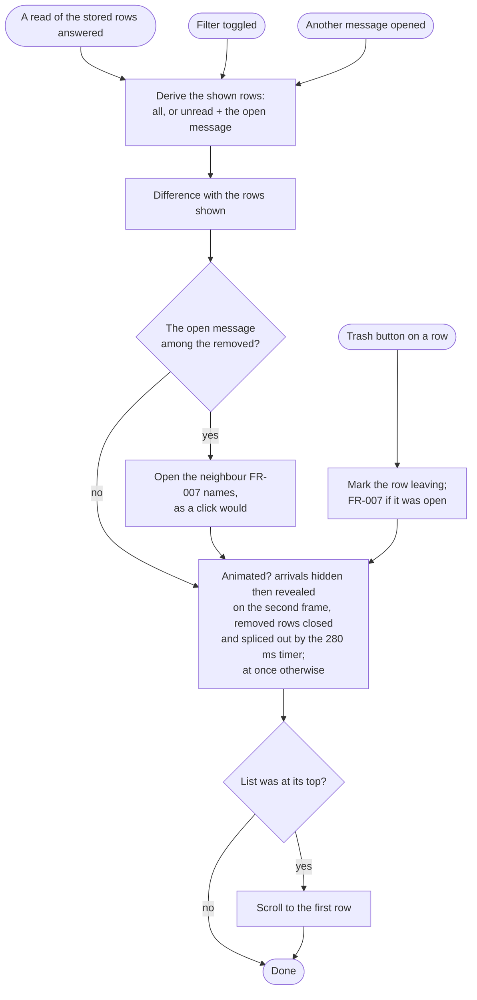

# Implementation Plan: Message list

**Branch**: `claude/message-list` | **Feature**: `010-message-list`
**Date**: 2026-09-30 | **Spec**: [spec.md](spec.md)
**Status**: Approved on 2026-09-30 (tasks T001), after the challenge of
the same day (mechanisms and their cost, fresh session) with the
decisions applied. Supporting documents:
[research.md](research.md), [data-model.md](data-model.md),
[contracts/message-list.md](contracts/message-list.md),
[quickstart.md](quickstart.md).

## Size

Budget agreed at the feature-start on 2026-09-30 and confirmed the same
day after the maintainer added read on opening and Move to Trash from
the row: at most 750 production lines and 850 test lines; two timers
(the removal animation's, the read on opening's) and one frame callback
(the reveal of an arrived row on the next frames); no thread or queue of
the feature's own; no new dependency; no change to the IMAP library
forks. The test budget was raised to 920 lines on 2026-10-01, when the
row's portion took 261 test lines against its 170, and the budget was
then accepted at ≈ 865 production and ≈ 995 test lines after portion 5
and its simplify review, and at ≈ 895 and ≈ 1 025 after the external
review's fixes (the maintainer's decisions). Estimates include doc comments and formatting. Reassess with the
maintainer before exceeding the budget or about 1.5 times an item's
estimate; the size so far is compared with this table at every review
pause.

| Item | Budget | This plan (estimate) |
|---|---|---|
| New modules and production lines | ≤ 750 net | ≈ 690: `mailbag-content` ≈ 150 (the page section in the reader's walk ≈ 15, the clean cut and the reader's decoder reused ≈ 15, page words ≈ 40, normalising ≈ 45, glue and records ≈ 35); `mailbag-domain` ≈ 6; `mailbag-imap` ≈ 25 (the limit in a text request, the section suffix); `mailbag-graph` ≈ 10 (`bodyPreview`); `mailbag-providers` ≈ 110 (structures and pieces for every fetched message, both pieces for an old message with both forms, the preview with the content ≈ 90; Microsoft 365 ≈ 20); `mailbag-store` ≈ 20 (column, write, read); `mailbag` ≈ 370 (row object: preview, date wording, animation properties ≈ 50; derived rows, the filter and the read-in-window set ≈ 45; animations with the frame callback and the timer, timers dropped on clear ≈ 85; the next message as a pure function ≈ 35; read on opening ≈ 25; the trash removal with the narrow-window rule ≈ 35; scope handlers ≈ 25; keeping the top in view ≈ 10; the locale's time form ≈ 10; the window: the toggle, the folder-change rule, the status wording ≈ 50) |
| Call sites or existing files touched | — | domain `lib.rs`; content `lib.rs` (shared rules exposed), new `preview.rs`; imap `lib.rs`, `reader.rs`, `fetch_responses.rs`, `test_server.rs`; graph `lib.rs`, `test_server.rs`; providers `imap_texts.rs`, `cycle/imap.rs`, `cycle/graph.rs`, `microsoft365.rs`; store `schema.sql`, `lib.rs`, `folders.rs`; mailbag `main.rs`, `window_ui.rs`, `mail_ui.rs`, `mail_ui/message_item.rs`. Forms: `message-row.ui` (rewritten), `mailbag.ui` (status wording; the toggle exists) |
| New crates | 0 | 0 |
| New threads, timers, queues | 2 timers | 2 timeouts (one per change for leaving rows, one for the open message's read state) and one frame callback (the reveal of arrived rows), which is not a timer but a third time-based mechanism |
| New state, types, error types | — | Content: `PreviewPart`, the page section in the walk; imap: `limit` on `TextRequest`; window: `ListChange`, the row object's `preview`, `shown`, `transition-ms`, the shown folder and the filter state, the read-in-window set, the pending read, the leaving rows. No new error type |
| New fields in existing data | — | `message.preview`; `Message.preview`; `MessageListRow.preview`; `GraphMessage.body_preview` ([data-model.md](data-model.md)) |
| Changes to other features' contracts or documents | 009, 007, 002 | As the spec's Amendments; 009's contract gains `Message.preview`; 002 contracts/ui.md's row table |
| New dependencies | 0 | 0 (mail-parser's HTML conversion and raw decoders are already there) |
| Tests | ≤ 920 (≤ 850 until 2026-10-01) | ≈ 800: content ≈ 230 (SC-001's forms, cut pieces, page words, normalising), imap ≈ 60 (a limited request and its partial answer), graph ≈ 20, providers ≈ 120 (previews in IMAP and Microsoft 365 batches, both pieces, a refused piece; scripted-server support ≈ 40 of these), store ≈ 30, window ≈ 340 (unit tests of the next-message rule, the shown-rows derivation and the locale's time form as pure functions, with and without the filter; one GUI test per behaviour: the trash removal, the filter with read on opening, an animated load and a folder shown anew, date wording, 100 000 rows) |

## Summary

Every message gets a preview when its batch is stored: the cycle fetches
the structure of each message it fetches rows for, chooses its page or
plain part, reads the first 64 kilobytes of it (16 until the live check
of 2026-10-01, research §3), and `mailbag-content`
turns the piece into up to 400 characters of words (research §1–§6);
Microsoft 365 hands its own text preview over instead (§7). The preview
is a column of the message (§8). The row form is rewritten as the spec
describes, with the trash button over the row's end revealed on hover
through handlers the form names (§9). The list animates arrivals and
removals among the rows shown, with a revealer in the row and one timer
per change, and changes at once when the folder shown changes (§10); the
unread filter derives the shown rows from the stored ones and reuses the
difference update (§11); when the user takes the open message out, the
next message opens by the maintainer's rule (§12); an opened message
counts as read after a second, in the window only (§13); dates read like
a calendar in the user's locale (§14).

## Minimal version

| Step | What it does | Cost |
|---|---|---|
| Preview words | `preview.rs` in `mailbag-content`: `select_preview_part` on the reader's walk, `preview_of_piece` with the clean cut, `preview_of_text` | ≈ 150 |
| Stored preview | `Message.preview`, `MessageListRow.preview`, the column, write and read | ≈ 26 |
| IMAP piece | `TextRequest.limit`, the `<0.N>` suffix; in the cycle: structures for every fetched message, the preview part's piece with the batch's texts, both pieces for an old message with both forms, the preview in each arrived record | ≈ 115 |
| Microsoft 365 | `bodyPreview` in the fields, `preview_of_text` in `stored_message` | ≈ 30 |
| The row | `message-row.ui` rewritten; the row object's preview, date wording in the locale's form and animation properties; the scope with the hover and trash handlers | ≈ 120 |
| The list's changes | Derived rows, the filter and the read-in-window set; animations, at once when the folder shown changes; the next message; read on opening; the trash removal with the narrow-window rule; the top kept in view; the toggle and the status wording | ≈ 245 |

## How a preview reaches a row

```mermaid
sequenceDiagram
    participant K as Mail worker (cycle)
    participant S as Server
    participant C as mailbag-content
    participant D as Store
    participant W as Window

    K->>S: rows of the batch's messages (as today)
    K->>S: structures of those messages (one command per 100)
    K->>C: select_text_parts (recent messages) and select_preview_part (all)
    K->>S: texts of recent messages with their pages; pieces <0.65536> of the others
    K->>C: preview_of_piece(header, piece, is_html) per message
    K->>D: store_batch with Message.preview
    K-->>W: BatchStored
    W->>D: read_folder_rows → rows with previews
    W->>W: derive the shown rows; update the list by difference
```

## How the list changes



## Function map

**`mailbag-content::preview`** — the preview rules, no I/O.

- `select_preview_part(root) -> Option<PreviewPart>`: the reader's walk
  (`select_text_parts`), which now records the first non-attachment
  `text/html` section it meets; the page section wins, else the first
  plain section; none for encrypted and S/MIME-secured messages.
- `preview_of_piece(mime_header, piece, is_html) -> String`:
  1. `clean_cut` — a trailing incomplete base64 group dropped when the
     header names base64; then the reader's `decode_text_part`; a
     trailing replacement mark dropped.
  2. `page_words` when `is_html` — a space before each block tag, then
     `html_to_text`.
  3. `normalise_words` — white space, invisible characters, bracketed
     placeholders, 400 characters.
- `preview_of_text(text) -> String`: step 3 alone.

**`mailbag-providers`** — the preview with the batch.

- `imap_texts::read_contents(reader, uids, recent) -> BTreeMap<u32,
  (ReceivedContent, String)>`: structures for `uids`; for each message
  the reader's parts when it is recent and the preview part always, plus
  the plain part's piece for an old message with both forms; one
  `fetch_text` call with the full requests and the limited ones; the
  content as today and the preview from the page piece, else from the
  plain piece or the recent message's text (an empty preview when nothing
  was returned or no part was chosen).
- `cycle::imap::fetch_arrivals`: passes every fetched UID with the recent
  ones marked; `Message.preview` from the answer.
- `cycle::graph::stored_message`: `preview_of_text(body_preview)`.

**`mailbag-store`**

- `store_arrived`: the column in the upsert.
- `read_listed_rows`: the column in the row.

**`mailbag::mail_ui`** — the list.

- `MailUi::new`: the factory with a `BuilderRustScope` holding
  `row_entered`, `row_left` (reveal or hide the revealer they receive)
  and `trash_row` (the list item they receive → `remove_in_window`).
- `show_rows(folder, rows)`: `AtOnce` for another folder or an empty
  list, else `Animated`; keep the stored rows; empty the read-in-window
  set; `update_shown(change)`.
- `shown_rows(rows, filter_on, open, read_in_window) -> Vec<row>`: a pure
  function: all rows, or the unread ones (not in the set) and the open
  message.
- `set_unread_filter(on)`: `update_shown(AtOnce)`.
- `remove_in_window(identity)`: `update_shown` with the row left out,
  animated; in a narrow window the reader's page is not brought forward.
- `update_shown(change)`:
  1. `next_after_leaving(above, below) -> Choice` — a pure function of
     the two neighbours' states (none, read, unread) that names FR-007's
     row; when the open message is among the rows to remove, its
     neighbours in the list as shown (leaving rows left out) are passed
     and the choice is opened by `open_message`; a refresh's removal of
     the open message closes the reader instead.
  2. When `Animated`, `close_leaving_rows` closes the rows that leave
     and `change_after_closing` applies the change after one 280 ms
     timeout, started again by a later closing and cancelled by a change
     at once; otherwise, or with
     nothing to close, `change_list` applies it now:
     `update_list_by_difference` as today, arrivals inserted hidden when
     animated; the read states treat rows in the read-in-window set as
     read (research §10, as changed at the implementation).
  3. Arrivals and reopened rows shown on the second frame (a tick
     callback) when animated, at once otherwise.
  4. `keep_top_in_view` — `scroll_to(0)` when the list was at its top
     before the change.
- `open_message(position, bring_reader_forward)`: as today, refusing a
  closed row, plus `start_read_on_opening` (drop the pending timeout; a
  one-second timeout that puts the identity into the read-in-window set
  and sets the row object's `unread` false).
- `close_reader` and `clear`: drop the pending read timeout; a closing's
  timeout that fires after them finds nothing to change.

**`mailbag::mail_ui::message_item`** — the row object: `preview` (the
stored preview; the label's two lines cut it), `date_text` by the date
rule, with `locale_time_form(sample_x, sample_p) -> TimeForm` a pure
function that tells the 12-hour form by the AM/PM marker inside the
locale's full time format (research §14), `shown` and `transition_ms`,
`unread` as today.

**`mailbag::window_ui`**

- `render`: `show_rows(folder, rows)`; when the filter or the trash
  button leaves no row, "No unread messages" with the filter on, else
  "Mailbox is empty"; the trash button asks for a render.
- The `unread_filter` toggle: `set_unread_filter`; `main.rs` no longer
  makes it insensitive.

## Optional mechanisms

Not in the minimal version; each with the situation that would call for it.

| Mechanism | Situation | Cost |
|---|---|---|
| Removing elements hidden by style | Previews led by hidden opening lines prove distracting | ≈ 40, a style-aware scan |
| Watching the day boundary | A window left open past midnight shows "today" for yesterday's rows | a timer at midnight |

## Decisions for the maintainer

Taken on 2026-09-30:

1. The row form as a text diff with a rendering (Cambalache cannot open a
   list item template, research §9); its structure follows the spec's
   FR-002. Accepted.
2. The row's time follows the locale's 12- or 24-hour form (research
   §14): the maintainer's decision after a fixed 24-hour form and the
   desktop's Time Format setting through the portal (≈ 55 lines) were
   weighed.
3. The unread filter as derived rows, not a filter model (research §11),
   with the read-in-window set the challenge added. Accepted.
4. No animation flag at the load's start: a change animates unless the
   folder shown changed or the filter changed (research §10). Dropped at
   the challenge.
5. The 16-kilobyte piece for every encoding (research §3, §4), with both
   pieces for an old message that has both forms. Accepted.

## Portions and review pauses

Each portion ends with its tests and `scripts/check.sh`, a report and a
suggested commit message; the size so far is compared with the table
above. The maintainer commits.

1. **Documents** — this plan and its documents approved; the amendments
   applied (below). *Pause.*
2. **Preview words** — `mailbag-content::preview` with its fixtures for
   every supported form (SC-001 on fixtures). *Pause.*
3. **Stored previews** — domain fields, the column, IMAP pieces and the
   cycle, Microsoft 365's `bodyPreview`, the scripted servers; SC-002 on
   the scripted servers. *Pause.*
4. **The row** — the form rewritten (approval of the diff and the
   rendering), the row object's preview and date wording in the locale's
   form, the hover handlers with the scope, the toggle with derived rows
   and the empty-filter wording; SC-004, SC-007. *Pause.*
5. **Changes while shown** — animations, the next message, read on
   opening, the trash removal with the narrow-window rule; SC-003,
   SC-005's states, SC-009, SC-010; the quickstart's installed-build
   checks with the maintainer, the first fill timed and written into the
   spec. *Pause.*
6. **Final passes** — consistency analysis, simplify review and the
   refactor, as the maintainer runs them; the amendments checked.

## Technical Context

**Language/Version**: Rust 2024 edition (workspace toolchain), GTK 4.22,
libadwaita 1.9, GLib 2.88.
**Primary Dependencies**: gtk4-rs 0.11 (`BuilderRustScope`), mail-parser
0.11.9 (`html_to_text`, raw decoders), rusqlite, the async-imap and
imap-proto forks unchanged, soup3 for Microsoft Graph.
**Storage**: SQLite through `mailbag-store`; one new column.
**Testing**: `cargo test --locked --workspace` through `scripts/check.sh`;
GUI tests one per process; scripted IMAP and Graph servers.
**Target Platform**: GNOME on Linux, Flatpak.
**Project Type**: desktop application.
**Performance Goals**: a folder of 100 000 rows with previews listed and
scrolled without freezing (SC-006); a first fill's first batch listed
with previews within 5 seconds on the scripted server (SC-008).
**Constraints**: previews made off the GTK thread with the batch; no
request while the list is shown; two timers and one frame callback, no
thread.
**Scale/Scope**: three providers; folders of 100 000 messages.

## Constitution Check

- **I. Necessary complexity only**: every mechanism answers a scenario the
  spec states: the piece and its clean cut (previews for old messages,
  cut parts), the timer (a leaving row off screen), the read-in-window
  set (a toggle or another opening would bring the dot back), derived
  rows (a read row leaving the filtered list animated). Optional
  mechanisms are listed apart. No dependency added.
- **II. Clear language and concrete names**: functions are named for
  their action (`select_preview_part`, `preview_of_piece`,
  `remove_in_window`, `next_after_leaving`); the spec names the
  situations first.
- **III. Explicit failures and truthful state**: a preview is never made
  up; a refused piece is an empty preview and the reader explains; the
  window-only read state and removal are the maintainer's decision for
  the pre-release build, recorded with the objection (spec
  Clarifications), and every read of the store shows the stored truth.
- **IV. One owner per business rule**: the preview rules live in
  `mailbag-content`; the next-message rule and the filter in `mail_ui`;
  the batch shape in `mailbag-domain`.
- **V. Responsive, bounded work**: pieces are bounded (64 kilobytes);
  previews are made on the worker; the list builds visible rows only.
- **VI. Evidence before completion**: SC-001 to SC-010 mapped to tests
  and the quickstart; the installed-build checks are the maintainer's.

No violation to justify.

## Project Structure

### Documentation (this feature)

```text
specs/010-message-list/
├── plan.md
├── research.md
├── data-model.md
├── quickstart.md
├── contracts/message-list.md
├── checklists/requirements.md
└── tasks.md              # $speckit-tasks
```

### Source Code

```text
crates/mailbag-content/src/preview.rs        # new: the preview rules
crates/mailbag-content/src/lib.rs            # shared part rules exposed
crates/mailbag-domain/src/lib.rs             # preview fields
crates/mailbag-imap/src/{lib,reader,fetch_responses,test_server}.rs
crates/mailbag-graph/src/{lib,test_server}.rs
crates/mailbag-providers/src/{imap_texts,microsoft365}.rs
crates/mailbag-providers/src/cycle/{imap,graph}.rs
crates/mailbag-store/src/{schema.sql,lib,folders}.rs
crates/mailbag/src/{main,window_ui,mail_ui}.rs
crates/mailbag/src/mail_ui/message_item.rs
crates/mailbag/resources/ui/{message-row,mailbag}.ui
```

**Structure Decision**: the existing crates; one new module in
`mailbag-content`.

## Documents amended before implementing

As the spec's Amendments, applied in portion 1:

- 009 spec FR-003, FR-009, FR-013, FR-015(d); 009 contracts (the batch's
  `Message` gains `preview`).
- 007 spec FR-014(e); 007 data-model (the column).
- 002 spec FR-004; 002 contracts/ui.md (the row table).
