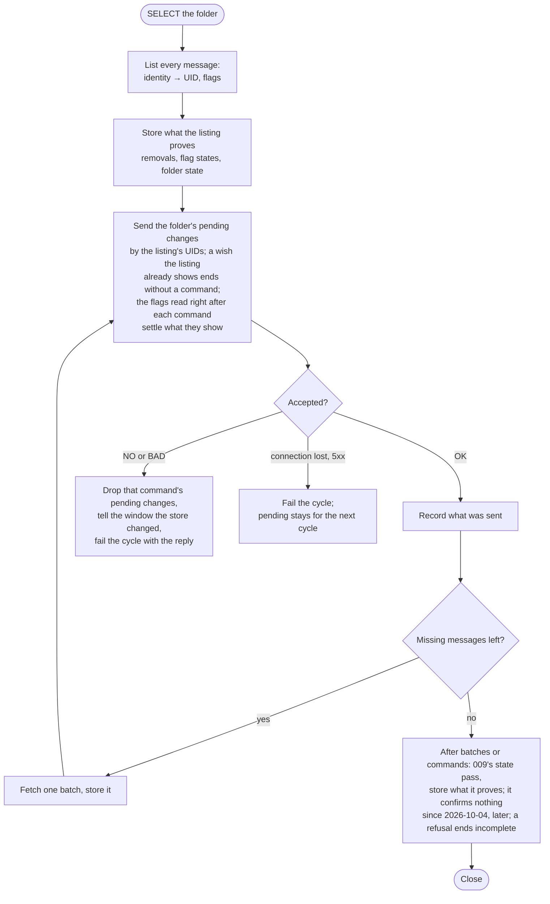

# Implementation Plan: Read and star

**Branch**: `claude/read-star` | **Feature**: `011-read-and-star`
**Date**: 2026-10-02 | **Spec**: [spec.md](spec.md)
**Status**: Approved on 2026-10-03 (tasks T001). Challenged on 2026-10-02
(the spec's requirements, then this plan's mechanisms and their cost, in
fresh sessions), analysed for consistency on 2026-10-03 and reviewed from
outside the same day (research §14: a change made while a command is in
flight was lost); the decisions are applied here and recorded in the
spec's Clarifications. Supporting documents: [research.md](research.md),
[data-model.md](data-model.md), [quickstart.md](quickstart.md). No new
contract: the shared shapes this feature changes belong to 009's contract
and are amended there.

## Size

Budget agreed on 2026-10-02 at the sizing: at most 600 production lines
and 700 test lines, the test budget raised to 800 on 2026-10-03 after the
challenge measured the repository's GUI tests and to 850 the same day for
the external review's race tests; no thread, timer or queue
of the feature's own; no new dependency; no change to the IMAP library
forks; three new columns on the stored message. Estimates include doc
comments and formatting. Reassess with the maintainer before exceeding
the budget or about 1.5 times an item's estimate; the size so far is
compared with this table at every review pause.

| Item | Budget | This plan (estimate) |
|---|---|---|
| New modules and production lines | ≤ 600 net | ≈ 560: `mailbag-domain` ≈ 40 (`MessageFlag`, `MessageFlags`, `FlagChanges`, `PendingChange`, `flagged` on the message and the row, flag states in the batch, one server step); `mailbag-store` ≈ 95 (three columns; effective values in the row read; the batch write of the reported flags, ending an equal pending value; `read_pending_changes` with the server values; `write_pending_flag`; `settle_flags` and `drop_pending_flags`, each ending only a pending value equal to the command's); `mailbag-imap` ≈ 70 (`SELECT`; `\Flagged` in the listing and the rows; `store_flags` ≈ 40; one step); `mailbag-graph` ≈ 55 (`flag` among the fields and in a change, merged like `isRead`; `update_message_flags` ≈ 30); `mailbag-providers` ≈ 170 (the cycles' read side of the star ≈ 20; new `cycle/pending.rs`: the IMAP sender with a hundred UIDs per command ≈ 55, the Microsoft 365 sender with 5xx as an unknown outcome ≈ 40, a pending value equal to the server's ended without a command ≈ 8; the batch writer's three calls, the `StoreChanged` event and counts ≈ 25; the loops of both cycles ≈ 15; the failure mapping ≈ 10); `mailbag` ≈ 130 (the `message` action group and its handlers ≈ 45; the window's writes one at a time, the re-read and the failed write's toast ≈ 40; the star in the difference update and the envelope's icon ≈ 8; read on opening writes the pending change and the read-in-window set goes ≈ −5; the `starred` row property and its accessible text ≈ 12; the header menu's two actions ≈ 15; the failure wording ≈ 6; the row form ≈ 12 lines of `.ui`) |
| Call sites or existing files touched | — | domain `lib.rs`; store `schema.sql`, `lib.rs`, `folders.rs`; imap `lib.rs`, `session.rs`, `reader.rs`, `fetch_responses.rs`, `test_server.rs`; graph `lib.rs`, `reply.rs`, `test_server.rs`; providers `load.rs`, `cycle.rs`, `cycle/imap.rs`, `cycle/graph.rs`, new `cycle/pending.rs`, `store_load.rs`, `failure.rs`; mailbag `main.rs`, `window_ui.rs`, `mail_ui.rs`, `mail_ui/message_item.rs`, `failure_declarations.rs`. Forms: `message-row.ui` (the star), nothing else (the controls exist) |
| New crates | 0 | 0 |
| New threads, timers, queues | 0 | 0; 010's read-on-opening timer is reused, the worker and the GIO pool carry the work |
| New state, types, error types | — | `MessageFlag` (seen, flagged), `MessageFlags`, `PendingChange`; `ImapStep::StoreFlags` and `ServerStep::ChangeFlags` for the wording; the star action's state in the window, set from the rows; the window's queue of pending writes, one running at a time. Nothing new in `Refreshes` |
| New fields in existing data | 3 columns | `message.flagged`, `message.seen_pending`, `message.flagged_pending`; `Message.flagged`, `MessageListRow.flagged`; `FolderBatch.flag_states` and `known_arrived` carry both flags; `FolderSync.stored` carries both flags; `ListedUid.flagged`, `MessageRow.flagged`, `GraphMessage.flagged`, `MessageChange::Changed.flagged`; `LoadEvent::BatchStored` renamed `StoreChanged` ([data-model.md](data-model.md)) |
| Changes to other features' contracts or documents | 009, 007, 010, 002, 008 | As the spec's Amendments; 009's contract gains the flag shapes, the sending step and the event's new name |
| New dependencies | 0 | 0 (soup3 0.9 already offers `set_method` and `set_request_body_from_bytes`, checked in the crate source) |
| Tests | ≤ 850 | ≈ 825: store ≈ 130 (effective values; the pending write and its short-circuit; a batch write ending an equal pending value and leaving a differing one; settle; drop; the pending query); imap ≈ 120 (`SELECT` sent, `\Flagged` listed, `store_flags` with OK, NO, BAD and a lost connection; the scripted server's mutable flags, `UID STORE` and a held completion ≈ 65 of these); graph ≈ 100 (the request's method, body and headers; a 200, a 400, a 404 and a 504; the partial and full entries; the scripted service recording method and body ≈ 35 of these); providers ≈ 240 (SC-001's one command per change, a change made while a command is in flight, hundreds of UIDs in several commands, a 504 kept pending, a message in two pages of one round, SC-003's send between batches and before closing, SC-004's two outcomes, SC-005's refusal with the re-read event, SC-006's two labels, Microsoft 365's send after the round); window ≈ 235 (GUI tests, one per behaviour, 40–80 lines each: the star toggle and the row after the re-read; two rapid changes written in the user's order; Mark as Unread keeps the message open and the timer silent; read on opening writes the pending change after the second and not before, SC-007; the refused change shown as a failed refresh with the row reverted; the cycle-start gating and the restart need no GTK and are the store's and `refresh_mailbox`'s existing tests) |

## Summary

A change the user makes becomes a wanted value of one flag on the stored
message, kept in two nullable columns next to the server's own values
(research §3); the store reads rows as the effective state, so the window
never sees the server's stale value (data-model). The window writes the
change on the GIO pool and then reads the folder's rows again, as it does
after every stored batch; it never sets a row's state by itself (§12). No
change starts a cycle: Refresh does, as 009 says (§8). A cycle lists the
folder as today, stores what the listing proves, and from then on sends
before each batch of missing messages and once before closing: it reads
the folder's pending changes, addresses each message by the UID the
listing gave for its identity, and sends one `UID STORE … ±FLAGS.SILENT`
per group of equal changes, a hundred messages per command, in a mailbox
opened with `SELECT` (§2, §4); on Microsoft 365 it sends one `PATCH` per
message after its round of changes (§6). A pending change ends only when
the cycle sees the server hold it (§15): on IMAP a listing of the cycle
shows the value (the first listing, without a command, for a change not
yet sent; the flags read right after the command for one it sent, since
2026-10-04 (later); an OK ends nothing); on Microsoft 365 the service accepts the request,
and every pending change is sent. The settle writes server value := that
value and ends a pending value equal to it, in one transaction; a newer
wish for another value stays for the next sending step (§14). A server
report alone never ends a pending value. A refusal
drops the pending values equal to the refused one, tells the window the
store changed, and fails the cycle with the server's reply (§7). A lost
connection, or a 5xx answer, leaves the pending change for the next cycle
(§2, §14).

## Minimal version

| Step | What it does | Cost |
|---|---|---|
| Stored flags and pending values | three columns; effective values in the row read; the batch write of the reported flags, leaving the pending values (§15); `read_pending_changes`; `write_pending_flag`; `settle_flags` and `drop_pending_flags`, ending only a pending value equal to the command's | ≈ 135 (domain + store) |
| Mailboxes opened for writing | `session::select_mailbox` replaces `examine_mailbox`; the reconnect path uses it too | ≈ 8 |
| The flags on the wire | `\Flagged` parsed with `\Seen`; `MailboxReader::store_flags(uids, flag, set)`; `flag` among the Microsoft 365 fields, `flagStatus` read and merged; `update_message_flags` | ≈ 110 (imap + graph) |
| The cycle sends | the cycles' read side of the star; `cycle/pending.rs`: `send_imap_changes` (a hundred UIDs per command), `send_graph_changes` (a 5xx keeps the pending change), an IMAP wish equal to the listing's value ended without a command, the sent values and, since 2026-10-04 (later), the flags read right after each command that settle them (§15; until then the listing after the commands); the batch writer's `pending_changes`, `settle`, `drop_pending` and the `StoreChanged` event; both loops restructured | ≈ 170 |
| The window | the `message` action group; the writes one at a time on the pool, the re-read and the failed write's toast; the star in the difference update and the envelope's icon; read on opening writes the change; the star in the row; the header menu's two actions; the failure wording | ≈ 130 |

## How a change travels

```mermaid
sequenceDiagram
    participant U as User
    participant W as Window (GTK thread)
    participant P as GIO pool
    participant D as Store
    participant K as Mail worker (cycle)
    participant S as Server

    U->>W: star / Mark as Unread / the second after opening
    W->>P: write_pending_flag(account, identity, flag, wanted)
    P->>D: UPDATE message SET flagged_pending = … (the wish as made)
    P-->>W: written
    W->>P: read_folder_rows (as after every stored batch)
    P-->>W: rows with the effective state → the row and the toggle
    U->>W: Refresh Mailbox (later: background synchronization)
    W->>K: a cycle of the folder
    K->>S: SELECT, UID FETCH 1:* (UID FLAGS [X-GM-MSGID])
    K->>D: store the listing (server values; pending values untouched)
    K->>D: read_pending_changes(folder)
        K->>S: UID STORE 4711,4720 +FLAGS.SILENT (\Flagged)
    S-->>K: OK (the cycle records what it sent)
    K->>S: UID FETCH 4711,4720 (UID FLAGS), the reading after the command (since 2026-10-04, later)
    K->>D: settle_flags: flagged := 1, flagged_pending := NULL where it equals 1, for the messages the reading shows starred
    K->>S: fetch the missing messages, a batch at a time (sending again before each)
    K->>S: SELECT once more: 009's state pass after batches or commands, which confirms nothing
```

## The cycle's loop



## Function map

**`mailbag-store`** — the columns and their rules (data-model).

- `read_listed_rows`: `COALESCE(seen_pending, seen)` and
  `COALESCE(flagged_pending, flagged)` as the row's `seen` and `flagged`.
- `read_folder_sync`: per identity the server's `seen` and `flagged`, as
  today's read with one more column.
- `store_batch`: `set_flag_states` writes the flags a report named
  (`FlagChanges { seen: Option<bool>, flagged: Option<bool> }`; `seen =
  COALESCE(?seen, seen)`); `store_arrived`'s upsert and `relate_known`
  write both flags; the pending columns are untouched (§15; written
  first as ending an equal pending value, replaced on 2026-10-04).
- `read_pending_changes(folder)`: the folder's messages with a non-null
  pending column, as `(identity, flag, wanted)`; a small query over the
  folder's memberships.
- `write_pending_flag(account, identity, flag, wanted)`: one `UPDATE`
  that sets the pending column to `wanted`, whatever the server column
  holds: a command for that flag may be in flight (§14).
- `settle_flags(account, identities, flag, value)`: server column :=
  `value`, pending column := `NULL` where it equals `value`, one
  transaction; a newer differing wish stays.
- `drop_pending_flags(account, identities, flag, refused)`: pending
  column := `NULL` where it equals `refused`.

**`mailbag-imap`**

- `session::select_mailbox`: `SELECT` where `EXAMINE` was; the same
  `MailboxSession` out; the reconnect path calls it.
- `fetch_responses`: `\Flagged` read next to `\Seen` into `ListedUid` and
  `MessageRow`.
- `MailboxReader::store_flags(uids, flag: StoreFlag, set) -> Result<Option<ImapError>, ImapError>`,
  with `StoreFlag { Seen, Flagged }` the crate's own enum (`mailbag-imap`
  does not depend on `mailbag-domain`; the sender maps `MessageFlag` to
  it):
  1. one `UID STORE <set> ±FLAGS.SILENT (\Seen|\Flagged)`;
  2. drain the answer with `collect_fetches` (Gmail still sends `FETCH`
     lines);
  3. `NO`/`BAD` completion → `Some(reply)`, with the sign-in name
     replaced as other replies; a lost connection → error at
     `ImapStep::StoreFlags`.

**`mailbag-graph`**

- `CHANGE_FIELDS` gains `flag`; `reply.rs`'s `read_message` reads
  `flag.flagStatus == "flagged"`; `read_change` carries `flagged: Option<bool>` and treats
  `flag` like `isRead` (a partial entry with either is not "other
  fields"); `merge_per_message` merges it like `is_read`.
- `update_message_flags(service_url, token, id, update) -> Result<(), GraphError>`:
  `PATCH /me/messages/{id}` with `{"isRead": …}` or `{"flag":
  {"flagStatus": …}}`, `Content-Type: application/json`, the ImmutableId
  preference; 200 is success, anything else the refusal
  `GraphFailure::Refused { status, code }` as today.

**`mailbag-providers::cycle::pending`** — the sending step, shared.

- `end_changes_the_listing_shows(listed, batches)` (added at the second
  review of 2026-10-04, §15): `batches.pending_changes()`; a wish the
  listing shows → `batches.settle`, no command. Called once, right after
  the listing is stored, while it is current.
- `send_imap_changes(reader, listed, sent_changes, batches)` (amended
  2026-10-04, §15):
  1. `batches.pending_changes()`; keep those the listing shows; a wish
     equal to the value in `sent_changes` → wait; the listing's values are
     not compared, since by a later step they may be minutes old;
  2. group the others by `(flag, wanted)`, a hundred UIDs per command;
  3. per command `store_flags`; `Ok(None)` → record each in
     `sent_changes`, then `fetch_flags(uids)` (amended 2026-10-04, later,
     §15): each message it reports with the wanted value →
     `batches.settle`, grouped by flag and value; one it does not report,
     or reports otherwise, stays pending; a reading the server refuses
     settles nothing; `Ok(Some(reply))` →
     `batches.drop_pending(uids,
     flag, wanted)` and `Err(CycleEnd::Failed(refused(reply)))`; `Err` →
     `Err` (pending stays).
- `send_graph_changes(service, batches)`: the same per message with
  `GraphService::update_flags(id, update)`, which runs
  `update_message_flags` through `request` (the renewal applies once as
  for any request); a 4xx other than the refused token drops and fails
  with `LoadFailure::MicrosoftGraphChangeRefused`, worded as IMAP's
  refused change ("Message not changed on the server");
  a 5xx fails the cycle with the pending change untouched, an unknown
  outcome (§14).
- `BatchWriter::pending_changes`, `settle`, `drop_pending`: the store
  calls with the cycle's failure mapping; `drop_pending` sends
  `LoadEvent::StoreChanged`, since the window must read the reverted row;
  `settle` changes no effective state and sends nothing; `finish` counts
  `settled`, the changes the cycle saw the server hold.
- `LoadEvent::BatchStored` is renamed `StoreChanged`: "the cycle changed
  the folder's stored state, a batch or a dropped pending change; the
  window reads again" (the challenge found the old name false for the
  drop).
- `cycle::imap::synchronize_imap_folder`: open → read → list → identify →
  missing → store the listing → end the wishes it shows → send → `for`
  each chunk `{ fetch; store;
  send }` → when a command was accepted, list once more and store the
  removals and flags it proves (amended 2026-10-04) → finish; the
  listing's `identity → uid` map lives in `listed_uids`. Amended again on
  2026-10-04 (§15): the cycle keeps `sent_changes`, and when it is not
  empty `confirm_sent_changes` lists again, stores what the listing
  proves, settles the sent changes it shows and returns its refusal, with
  which the cycle ends incomplete. *Later on 2026-10-04*:
  `confirm_sent_changes` becomes 009's second state pass, which lists
  only what the folder's numbers call for (009 plan, "Amendment
  2026-10-04"; 009 FR-005). *Later still on 2026-10-04*: the second pass
  confirms nothing; `settle_sent_changes` goes, and the sending step
  settles by `fetch_flags` (above, "Amendment 2026-10-04 (later)").
- `cycle::graph::synchronize_graph_folder`: after the round's last page
  is stored, and after each stored page of a first fill or a full
  reading, `send_graph_changes`, which sends every pending change (§15).

**`mailbag::mail_ui`** — the actions.

- `MailUi::new`: a `message` action group on the reader page: `star`
  (stateful boolean; `change-state` → `change_flag(Flagged, state)`) and
  `mark-unread` (→ `change_flag(Seen, false)`), the names the envelope's
  toggle and menu use; the menu, insensitive before, is enabled, its
  Archive and Move to Trash items staying greyed without actions. The
  mail pane also owns `app.mark-scope-read` / `app.mark-scope-unread`,
  which call `change_flag(Seen, true | false)`; `main.rs` publishes them
  through the window. They are enabled while a message is open, and the
  header's menu button, insensitive since 002, is left sensitive (the
  second review of 2026-10-04 found it still insensitive, so the two
  actions were unreachable from the window).
- `change_flag(flag, wanted)`: for `Seen = false` the pending read timer
  is dropped first of all, so Mark as Unread within the second leaves no
  timer to fire; then `change_listed_flag` for the open message, which
  hands the change to the window's `flag_change` callback. No check of
  the shown state: two quick opposite changes are both written, in order.
- `mark_read_after_opening`: the timer's closure calls
  `change_flag(Seen, true)` when the open row is still unread, instead of
  the read-in-window set, which is removed (010's `InWindow.read`).
- `update_list_by_difference`: sets `starred` as it sets `unread`, in
  place; `lists_same_message` leaves both out, since a new item would
  animate the row away and back.
- `show_envelope`: the star action's state and the toggle's icon
  (`starred-symbolic` while starred, `non-starred-symbolic` otherwise)
  and tooltip (Unstar while starred) from the item's `starred`; it runs
  on opening and after every re-read of the open message's row.

**`mailbag::mail_ui::message_item`**: `starred` property bound by the row
form; `read_state_text` says "Starred" too.

**The row's star** (amended 2026-10-03): `message-row.ui` holds the star
in the second line, after the subject, always allocated; its icon and
colour follow the item's `star-icon` and `star-style` (bound to
`css-classes`), which follow `starred` and `pointed`, the latter set by
the row's motion controller. For assistive technology it is decoration,
as the dot is (role `presentation`, no label, since the second review of
2026-10-04); the row's description carries the state. The unread dot's
tooltip went with the form's review on 2026-10-03. Its
click gesture claims the press, so the list's own click, which opens the
message on release in the bubble phase (GTK 4.22
`gtklistfactorywidget.c`), never sees it; on release the `toggle_row_star`
handler asks `MailUi::change_listed_flag(identity, Flagged, !starred)`,
which hands the change to the window as `change_flag` does for the open
message.

**`mailbag::window_ui`**

- `connect_flag_change`: the requested changes queue in a `VecDeque`
  and one `run_on_pool(store.write_pending_flag)` runs at a time, the
  next starting when it ends, so two writes land in the order of the
  user's actions (the timer's "read" and a Mark as Unread a moment later,
  §14); after each, on success `read_shown_mailbox_again()`, the same
  read as after a stored batch, whose answer sets the row and the toggle;
  on failure a toast
  "Message not changed. Try again." (spec FR-011; the constant
  `MESSAGE_NOT_CHANGED` in `failure_declarations`), nothing shown as
  changed, an error line with the failure's kind (the store writes its
  reason at debug). No cycle starts here.
- `LoadEvent::StoreChanged`: handled as `BatchStored` is today.
- `failure_declarations`: `ServerStep::ChangeFlags` → "Message not
  changed on the server", "The mail server refused to change this
  message." and the stopped-responding variant.
- What the user sees around a change: the row and the toggle change when
  the re-read answers, tens of milliseconds after the write; nothing else
  moves. The next Refresh Mailbox shows the spinner and disables the
  refresh actions as today while the cycle lists, sends and fetches.

## Optional mechanisms

Not in the minimal version; each with the situation that would call for it.

| Mechanism | Situation | Cost |
|---|---|---|
| A change starts a cycle of its folder when no load runs | The phone learns a star only at the next refresh; the maintainer chose Refresh only, since a cycle per change shows the spinner and disables Refresh for seconds, and offline fails with a banner per change (spec Clarifications); background synchronization lifts the lag | ≈ 15 |
| A set of folders due for a cycle after the running load | Changes made in other folders during a long load wait for the user's refresh of those folders | ≈ 15 |
| Re-read one row instead of the folder after a write | A folder of 100 000 rows costs about 100 ms per re-read on the pool, so the dot goes out that long after the second; a second path to update a row | ≈ 30 |
| Re-read the text only when list fields differ | On Microsoft 365 a star on a recent message comes back as a full entry and 009 re-reads its text once (research §6); many stars on recent mail cost one GET each | ≈ 20 |
| Smaller PATCH answers | The service returns the whole message (≈ 85 KB) to every change; on a slow link ten changes cost nearly a megabyte | unknown: a `Prefer: return=minimal` the service may not honour |
| Keep a pending change through a refusal the server marks temporary | Throttling or `UNAVAILABLE` drops the user's star with a truthful banner; the maintainer chose to treat every server error alike | ≈ 10 |

## Decisions for the maintainer

Taken on 2026-10-02 and 2026-10-03; recorded in the spec's Clarifications:

1. Pending changes kept in the store and sent by the cycle, not sent on
   their own with an optimistic window (research §1). Accepted.
2. The cycle lists first and sends after, before each batch and before
   closing (research §2). Accepted.
3. Two nullable columns on the message, not a table of changes (§3).
   Accepted on 2026-10-03 with the challenge decisions.
4. A refused command, a temporary refusal included, drops its pending
   changes and fails the cycle (§7). Accepted.
5. No change starts a cycle; Refresh does (§8). Accepted after the
   challenge.
6. The star in the row's first line before the date; the reader header's
   Mark as Read / Mark as Unread act on the open message. Accepted;
   amended on 2026-10-03 at the window's review: the row's star stands
   under the date, in a place every row keeps, and stars or unstars its
   message, with an outline star while the pointer is over the row.
7. Every write of a server value ends an equal pending value (§11;
   replaced on 2026-10-04 by §15: only the cycle's evidence ends one); the
   window re-reads the folder's rows after a write (§12; decided
   2026-10-03, one row stays optional); the cycle's event is named for
   what it means (§13).
8. A change the store cannot write is shown as a toast (spec FR-011):
   proposed at the consistency analysis of 2026-10-03, accepted the same
   day.
9. From the external review of 2026-10-03 (§14): a wish is stored as made
   and an accepted or refused command ends only a pending value equal to
   its own; a report writes only the flags it names; the timer is dropped
   before the equality check and the window's writes run one at a time; a
   Microsoft 365 change the next round does not report is sent again; a
   5xx is an unknown outcome (the maintainer's decision); a hundred UIDs
   per command. Test budget 850.
10. From the review of the implementation of 2026-10-04 (§15): a pending
    change ends only when the cycle sees the server hold it (an IMAP
    listing of the cycle; a Microsoft 365 request accepted); the refused
    listing after the commands ends the cycle incomplete; the row's star
    is no button for assistive technologies; two quick clicks on a star
    stay a recorded limitation. The maintainer's decision.
11. From the second review of 2026-10-04 (spec Clarifications): the header
    menu's button is sensitive and its two actions enabled with an open
    message; a wish equal to the listing's value ends without a command
    only at the first sending step, the later steps send what this cycle
    has not sent with that value (§15). The cost of the listing after the
    commands on large folders is not changed here; it goes to the probes
    at the start of background synchronization. The maintainer's decision.
12. From the third review of 2026-10-04 (spec Clarifications; research
    §15, amended): a sent change ends by the flags read right after its
    command, and the state pass after the commands confirms nothing; the
    command's own echo was weighed and not taken, since Gmail sends none
    for a command that changes nothing. The maintainer's decision, after
    the probe; the rule is constitution principle VIII.

## Portions and review pauses

Each portion ends with its tests and `scripts/check.sh`, a report and a
suggested commit message; the size so far is compared with the table
above. The maintainer commits.

1. **Documents** — this plan and its documents approved; the amendments
   applied (below). *Pause.*
2. **Stored flags** — domain types, the three columns, effective rows,
   the batch write ending equal pending values, the pending query, the
   three writes; store tests. *Pause.*
3. **The wire** — `SELECT`, `\Flagged` in listing and rows,
   `store_flags`, the scripted server's mutable flags and `UID STORE`;
   `flag` in the Microsoft 365 fields and changes, `update_message_flags`,
   the scripted service's `PATCH` with method and body recorded; crate
   tests. *Pause.*
4. **The cycle sends** — `cycle/pending.rs`, the batch writer's calls and
   the `StoreChanged` event, both loops, the failure mapping and wording;
   SC-001 (server side), SC-003, SC-004, SC-005, SC-006 on the scripted
   servers. *Pause.*
5. **The window** — the action group, the write on the pool and the
   re-read, the star in the difference update and the envelope, read on
   opening durable, the star in the row (form diff for approval), the
   header menu's actions; SC-007, SC-001 (window side), the refused change
   shown. *Pause.*
6. **Final passes** — consistency analysis, the GUI tests one by one, the
   simplification review, the quickstart's installed-build checks with
   the maintainer (SC-008); the amendments checked.

## Amendment 2026-10-04 (later): the reading after the command

Decided after the third review and a probe of three servers (spec
Clarifications, research §15), on branch `claude/read-star`, for one
portion (tasks Phase 8).

### Size

| Item | Budget | Estimate |
|---|---|---|
| Production lines | ≤ 60 net | ≈ 20: `mailbag-imap` ≈ 15 (`fetch_flags` through `list` taking the UID set, with its own record line); `mailbag-providers` ≈ 5 net (the settle after each command ≈ +25 in `send_imap_changes`, `settle_sent_changes` −20) |
| Files touched | — | imap `reader.rs`, `lib.rs`, `test_server.rs`; providers `cycle/pending.rs`, `cycle/imap.rs` |
| New threads, timers, queues, types, dependencies | 0 | 0 |
| Changes to other features' documents | 009, 002 | 009 spec FR-005(b) and SC-012, plan, research §15, contract; 002 contracts/imap-reading.md |
| Tests | ≤ 120 net | ≈ 60: imap ≈ 20 (the named UIDs alone, a UID the mailbox lacks left out); providers ≈ 40 (SC-004's command that changes nothing, confirmed in the same cycle with the scripted server's mod-sequence unchanged; the lacking UID; the tests of the listing after the commands rewritten for the reading) |

### Decision

A sent change ends by the server's report of its own message, read right
after the command; the state pass after the commands learns the folder's
own change and confirms nothing (spec FR-007(d), (e); research §15,
amended). The command's own echo, a `UID STORE` without `.SILENT`, was
weighed and not taken: Gmail reports nothing for a command that changes
nothing (the probe), so the echo cannot tell that from a UID the mailbox
lacks, and a reading would be needed for every message without an echo.

### Function map changes

- `MailboxReader::fetch_flags(uids: &[u32]) -> Result<FolderListing,
  ImapError>`: `UID FETCH <set> (UID FLAGS)` by the listing's code
  (`list` takes the set; the Gmail items are not needed, since the
  command's own `(identity, uid)` pairs name the messages); the server's
  refusal in `FolderListing.refusal`; its own record line at debug with
  the count it reports, not the listing's "mailbox listed".
- `send_imap_changes(...)`, its signature unchanged: after each accepted
  `store_flags`, `fetch_flags(uids)`; a message reported with the wanted
  value → `batches.settle` (grouped, one write per flag and value); not
  reported, or reported otherwise → stays pending, and `sent_changes`
  keeps it from being sent again this cycle; a reading the server refuses
  settles nothing (the reader records the refusal at debug).
- `synchronize_imap_folder`: the second pass stays (after batches or
  commands, `sent_changes` telling that commands went out) and
  `settle_sent_changes` goes.
- The scripted server: `raise_modseq` only when the `UID STORE` changed a
  flag, as Gmail does (server A raises it even so; the stricter server is
  the one to model, constitution VIII).
- Built as planned on 2026-10-04 (tasks T047, T048): the listing's body
  is `fetch_listing(set, items)`, shared by `list` and `fetch_flags`;
  `flag_of` names a flag's value in `pending.rs`;
  `settle_changes_server_holds` went with `settle_sent_changes`.

## Technical Context

**Language/Version**: Rust 2024 edition (workspace toolchain), GTK 4.22,
libadwaita 1.9, GLib 2.88.
**Primary Dependencies**: gtk4-rs 0.11, rusqlite, the async-imap and
imap-proto forks unchanged (`select`, `uid_store`, `\Flagged` exist),
soup3 0.9 (`set_method`, `set_request_body_from_bytes`).
**Storage**: SQLite through `mailbag-store`; three new columns; the
schema's text is the store's version (007 FR-012).
**Testing**: `cargo test --locked --workspace` through `scripts/check.sh`;
GUI tests one per process; scripted IMAP and Graph servers, which gain
`UID STORE` with mutable flags and `PATCH` with the body recorded.
**Target Platform**: GNOME on Linux, Flatpak.
**Project Type**: desktop application.
**Performance Goals**: a change shows within the store's write and the
rows' re-read (tens of milliseconds; about 100 ms for a folder of 100 000
rows) and reaches the server with the next refresh: on Gmail about 4 s
for a synchronized folder (sign-in ≈ 1.5 s, `SELECT` ≈ 0.3 s, the
listing ≈ 1 s, `STORE` ≈ 0.3 s, measured on 2026-10-02); on Microsoft
365 a `PATCH` ≈ 0.6–0.8 s after a round ≈ 0.4 s when nothing changed.
**Constraints**: store writes on the GIO pool, sending on the worker; no
timer or thread of the feature's own; one command per group of equal
changes on IMAP.
**Scale/Scope**: three providers; folders of 100 000 messages; a Gmail
message under many labels.

## Constitution Check

- **I. Necessary complexity only**: the pending columns answer "a refresh
  must not undo my change" (spec US1), sending between batches answers
  the minutes-long first fill (US3), ending a wish the IMAP listing
  already shows answers "star, then unstar" and "another client did it
  first" (Edge Cases, FR-009), the flags read after a command answer a
  command whose OK changed nothing (§15), the settle write answers the
  flicker between sending and the next listing.
  Optional mechanisms are listed apart with their situations. No
  dependency added; no fork change.
- **II. Clear language and concrete names**: `write_pending_flag`,
  `settle_flags`, `read_pending_changes`, `send_imap_changes`,
  `store_flags`, `update_message_flags`, `StoreChanged`; the spec names
  situations before mechanisms.
- **III. Explicit failures and truthful state**: the window shows a
  change only after its commit and only from the store; the server's
  refusal reverts the row and names the reply; an unknown outcome is
  settled by reading, never guessed; the stored server value is written
  only by cycles and by an accepted command.
- **IV. One owner per business rule**: the effective state is computed in
  one place, the store's row read; the equal-value rule lives in the
  store's flag writes; what each flag means on a provider lives in that
  provider's module; the sending rule in `cycle/pending.rs`.
- **V. Responsive, bounded work**: writes and re-reads on the pool,
  commands on the worker; one command per group; the listing already in
  memory is reused for the addresses; no load starts without the user.
- **VI. Evidence before completion**: SC-001 to SC-007 on the scripted
  servers and in GUI tests; SC-008 on the installed build with the
  maintainer; the live facts of 2026-10-02 in research.
- **VII. Gmail first**: the message-level flags and the Starred label are
  checked live; the listing-based addressing is designed for Gmail's
  many-labels model first and serves Generic IMAP unchanged; Microsoft
  365's full-entry cost is recorded and accepted.

No violation to justify.

## Project Structure

### Documentation (this feature)

```text
specs/011-read-and-star/
├── plan.md
├── research.md
├── data-model.md
├── quickstart.md
├── checklists/requirements.md
└── tasks.md              # $speckit-tasks
```

### Source Code

```text
crates/mailbag-domain/src/lib.rs                 # flags, pending change, server step
crates/mailbag-store/src/{schema.sql,lib,folders}.rs
crates/mailbag-imap/src/{lib,session,reader,fetch_responses,test_server}.rs
crates/mailbag-graph/src/{lib,reply,test_server}.rs
crates/mailbag-providers/src/cycle/pending.rs    # new: the sending step
crates/mailbag-providers/src/cycle/{imap,graph}.rs
crates/mailbag-providers/src/{load,cycle,store_load,failure}.rs
crates/mailbag/src/{main,window_ui,mail_ui,failure_declarations}.rs
crates/mailbag/src/mail_ui/message_item.rs
crates/mailbag/resources/ui/message-row.ui       # the star mark
```

**Structure Decision**: the existing crates; one new module in
`mailbag-providers`.

## Documents amended before implementing

As the spec's Amendments, applied in portion 1:

- 009 spec FR-001, FR-002(a), FR-015(a); 009 data-model ("not stored:
  pending changes" → the pending columns; the equal-value rule in the
  batch write; the cycle's pending query); 009 contracts/synchronization.md
  (`FolderBatch`'s flag states, `FolderSync`'s flags,
  `MessageListRow.flagged`, `ListedUid.flagged`, the sending step in the
  cycle's order, `LoadEvent::StoreChanged`).
- 007 spec FR-003 (no UID on a membership), FR-014(c) (built); 007
  data-model (the columns).
- 010 spec FR-002 (the star), FR-009 (durable; the in-window record
  retired), FR-011(b) (built), Key Entities (effective state); 010
  data-model (the row object's read state comes from the store's
  effective value; the read-in-window set goes).
- 002 contracts/imap-reading.md: the Inbox row (`SELECT`), the Finish row
  and SC-002's note (flag commands under 011 FR-007 are the only
  mail-changing commands).
- 008 spec FR-013(d): built note.
