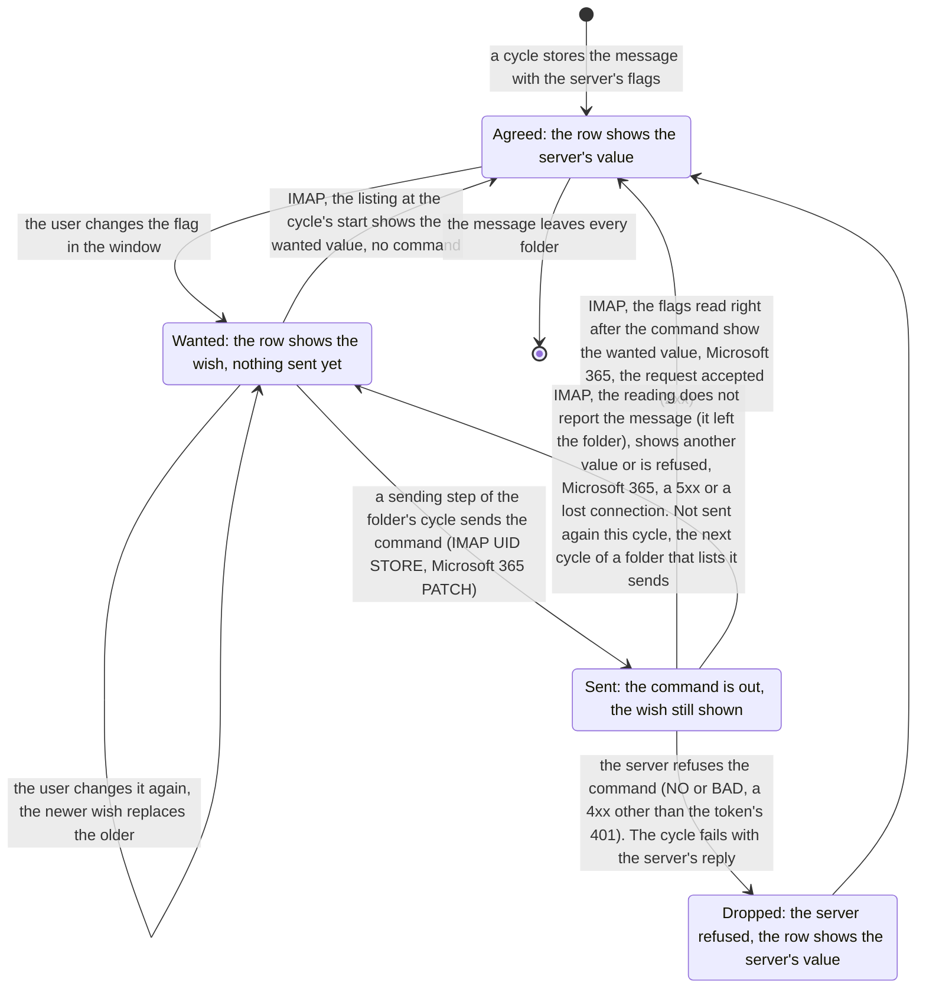

# Feature Specification: Read and star

**Feature**: `011-read-and-star`
**Created**: 2026-10-02
**Status**: Approved on 2026-10-03 (tasks T001), after the challenge and
the consistency analysis with their decisions applied. Sized on
2026-10-02, before writing (budget: at
most 600 production lines and 700 test lines, the test budget raised to
800 and then 850 on 2026-10-03; no thread, timer or queue of its own, no new
dependency, no change to the IMAP library forks; three new columns on the
stored message); the decisions taken there, and the facts checked against
live servers the same day, are recorded under Clarifications and
Assumptions. Challenged on 2026-10-02 (the requirements, then the plan's
mechanisms, in fresh sessions), analysed for consistency and reviewed
once more from outside on 2026-10-03; the decisions are under
Clarifications. FR-002 and FR-004 amended on 2026-10-03 at the review of
the window: the row's star stands under the date and stars or unstars
its message (Clarifications, the window's review). Reviewed once more in
full on 2026-10-04 (Clarifications, the second review). Amended on
2026-10-04 (later), after a third review and a probe of three servers: a
sent change ends by the server's report of its own message, read right
after the command, not by the listing after the commands (FR-007(b), (d),
(e), SC-004, Edge Cases; Clarifications, the third review; research §15).
**Input**: Marking a message read or unread and starring or unstarring it
are the first changes the user makes that last: they survive a refresh and
a restart, reach the server, and show up in every other client of the
account. A message the user keeps open for a second counts as read for
good. The window shows the user's change at once and keeps showing it
until the server has it; the next refresh carries it there; what the
server reports never hides a change the user made and the server does not
have yet. The same change means the
same thing on Generic IMAP, Gmail and Microsoft 365.

**Scope**: This is the complete read-and-star specification for Mailbag,
written for the target application: many accounts, many folders each, a
message that several Gmail labels list, mail from any server the
application supports. It owns the four changes (read, unread, star,
unstar), their meaning on each provider, the actions in the window that
make them, read on opening, how a change is kept until the server has it,
how and when it is sent, and what happens when the server refuses it or
the connection breaks around it.

It does not own which messages a folder holds and how a cycle learns the
server's state ([009](../009-synchronization/spec.md)); the list, the
row and the read-on-opening second ([010](../010-message-list/spec.md),
whose FR-009 this feature makes durable); moving and deleting, which use
the same keeping and sending rules for another kind of change; how many
messages an action takes at once (one, the open message, until a
selection exists); or when cycles run without the user (background
synchronization). What waits for a layer that does not exist yet is
marked deferred in FR-013 and gets no plan decisions, tasks or code
until that layer exists.

A *pending change* is the value the user wants for one flag of one
message (read or unread; starred or not) that the server does not have
yet. The *server state* is the flag as the server last reported it. The
*effective state* is what the window shows: the server state with the
pending change, if any, applied over it. A *cycle* and a *batch* are
009's.

## User Scenarios & Testing

### User Story 1 — A change lasts and reaches the server (Priority: P1)

The user stars a message, or marks it unread from the message menu. The
star lights and the dot returns at once, and they stay that way: after a
refresh, after a restart, after the folder is selected again. The next
refresh carries the change to the server, and the user's phone shows the
same star. A change the user makes while the network is down is kept and
goes out with the next refresh that reaches the server.

**Why this priority**: the feature is the first that changes mail; a
change that a refresh undoes would be worse than none.

**Independent Test**: a scripted server records the commands it
receives; the window's rows, the stored state and the server's record
are compared after each action, after a refresh and after a restart.

**Acceptance Scenarios**:

1. **Given** an unstarred message is open, **When** the user presses the
   star, **Then** the star lights and the row's star mark appears as soon
   as the change is stored, and at the next refresh the scripted server
   receives one command setting the flag on exactly that message.
2. **Given** the user starred a message, **When** the folder is refreshed
   or selected again, or the application is restarted, **Then** the
   message is still starred in the row and the reader.
3. **Given** a read message is open, **When** the user chooses Mark as
   Unread, **Then** the dot returns, the message stays open, the server
   receives the change, and the message is listed as unread by the next
   cycle's reading.
4. **Given** the network is down, **When** the user stars a message and
   refreshes, **Then** the star lights, the refresh fails as a refresh
   does today, and the next refresh that reaches the server sends the
   change.
5. **Given** the user starred a message and the server has it, **When**
   another client unstars it, **Then** the next cycle shows it unstarred:
   the server's state is the truth once it has the user's change.

---

### User Story 2 — Reading marks read, for good (Priority: P1)

The user opens a message and reads it. After about a second its dot goes
out, as the list already does, and now the change is stored and sent with
the next refresh: the message is read after a refresh, after a restart
and on the phone. Reading starts no refresh of its own: the window stays
quiet while the user reads.
A message the user glances at and leaves within the second stays unread.
Mark as Unread on the open message makes it unread again and keeps it
open; it is not marked read again until it is opened anew.

**Why this priority**: reading is the most frequent action; it is where
the window's state and the store's parted in 010.

**Independent Test**: scripted folders with unread messages; the stored
state and the scripted server's commands after opening, after waiting,
after Mark as Unread, after a restart.

**Acceptance Scenarios**:

1. **Given** an unread message, **When** the user opens it and keeps it
   open for a second, **Then** the dot goes out, the stored message is
   read, no load starts, and the next refresh sends the change.
2. **Given** an unread message, **When** the user opens another message
   within the second, **Then** the first is still unread in the store and
   nothing is sent for it.
3. **Given** a message marked read by opening, **When** the application
   restarts before a refresh, **Then** the message is listed as read.
4. **Given** the open message counts as read, **When** the user chooses
   Mark as Unread, **Then** the message is unread and stays open, and it
   is not marked read again while it stays open.
5. **Given** a read message, **When** the user opens it, **Then** nothing
   is stored or sent.

---

### User Story 3 — A change during a long refresh (Priority: P2)

A large folder fills for the first time, batch after batch, and the user
reads the messages already listed and stars some. Every change shows at
once and is sent while the fill goes on, between its batches, on the same
connection; none waits for the fill to end. A change the user makes in
another folder meanwhile is kept and sent by that folder's next refresh.

**Why this priority**: first fills take minutes; without this, the phone
lags behind by the length of the fill.

**Independent Test**: a scripted folder of a few hundred messages fills
in batches; the window stars a listed message during the fill; the
scripted server's record shows the flag command between two batch
reads.

**Acceptance Scenarios**:

1. **Given** a first fill of the shown folder is running, **When** the
   user stars a listed message, **Then** the star shows at once and the
   scripted server receives the command before the next batch is read.
2. **Given** a load of folder A runs, **When** the user marks a message
   read in folder B, **Then** the change shows at once, nothing is sent
   while A loads, and B's next refresh sends it.
3. **Given** a running cycle has read its last batch, **When** the user
   stars a message before the cycle closes, **Then** the cycle sends the
   change before closing.

---

### User Story 4 — The same change on every provider (Priority: P2)

Starring means the same on every account: on Gmail the message gets the
star and appears under Starred; on Microsoft 365 it is flagged for
follow-up; on any other IMAP server it carries the standard flag. A Gmail
message that several labels list is one message: read in Inbox, it is
read under every label and in All Mail, and the change is sent once.

**Why this priority**: constitution VII; the same action must not mean
different things by account.

**Independent Test**: scripted servers of each kind; a starred message is
found under the provider's own notion of starred; a scripted Gmail
message under two labels is changed in one and checked in the other.

**Acceptance Scenarios**:

1. **Given** a Gmail message listed under Inbox and under a user label,
   **When** the user marks it read in Inbox, **Then** it is read in both
   folders at once, the Inbox cycle sends one command, and the label's
   next cycle finds the server already agreeing and sends nothing.
2. **Given** a Microsoft 365 message, **When** the user stars it,
   **Then** the service marks it flagged for follow-up, and unstarring
   clears the flag.
3. **Given** a message in a Gmail Starred folder, **When** the user
   unstars it, **Then** it is unstarred at once and leaves the Starred
   folder when its next cycle proves it gone (009 FR-004).

---

### User Story 5 — The server refuses, the connection breaks (Priority: P3)

The server refuses a change: the change is undone in the window, the
refresh fails with the server's words, as a failed refresh does. The
connection breaks right after a change was sent: the user sees no
difference; the next cycle finds the server either already has the
change, and keeps it, or lacks it, and sends it once more.

**Why this priority**: rare, but the store must never hold a claim the
server rejected (constitution III).

**Independent Test**: a scripted server that refuses the flag command,
and one that closes the connection after accepting it; the window's row,
the stored state, the banner and the server's record are compared.

**Acceptance Scenarios**:

1. **Given** the scripted server refuses the flag command, **When** the
   cycle sends a star, **Then** the row shows the message unstarred, the
   refresh fails with a notice that carries the server's reply, and the
   next refresh sends nothing for that message.
2. **Given** the scripted server closes the connection after accepting
   the command, **When** the next cycle lists the folder, **Then** it
   finds the flag set, ends the pending change without sending, and the
   server's record holds one command for it.
3. **Given** the scripted server closes the connection before the command
   arrives, **When** the next cycle lists the folder, **Then** it finds
   the flag unset and sends the change once.

---

### Edge Cases

- The user stars and unstars before any cycle runs: the pending change is
  the newest wish; on IMAP the next cycle's listing shows it equal to the
  server state and it ends without a command; on Microsoft 365 the
  request is sent and sets the value the service has (FR-007).
- The user changes the flag again while a command for it is in flight:
  the newer wish stays, since an accepted or refused command ends only a
  pending change equal to its own value; the next sending step sends the
  newer wish (FR-007, FR-010).
- Another client changes the flag the other way before the user's change
  is sent: the user's change is sent and wins; afterwards the server's
  state is the truth (FR-007, FR-009).
- Another client changes the flag during a long first fill, and the user
  then changes it in the window to the value the cycle's listing showed:
  the wish is sent all the same, since only the first sending step trusts
  the listing, and the flags read right after the command end it (FR-007).
- A wish made and taken back between two sending steps of a fill, or Mark
  as Unread after reading there (at the first step the listing ends such
  a wish): the command asks for the value the server already holds, so the server changes nothing and may leave its
  mod-sequence as it was (RFC 7162 §3.1.11), and no listing by the
  folder's numbers would show the message; the flags read right after
  the command show the value and end the change (FR-007(d)).
- The message leaves the server before its change is sent: on Generic
  IMAP the listing proves it gone and the message goes with its pending
  change; on Gmail it stays under its other labels and that label's cycle
  sends the change; a message left in no folder is deleted with it (009
  FR-004 and its data model).
- Mark as Unread within the second after opening: the second's timer is
  dropped first, nothing is marked read (FR-003); when the timer's write
  has already started, the unread wish is written after it.
- A Microsoft 365 round reports one message in two pages, the first with
  its read state, the second with its star alone: each writes only what
  it reports; the read state stays (FR-001).
- A Microsoft 365 page reports the wished value, or a later page or round
  replays an older one: no report ends the pending change; the request is
  sent after the round, and its acceptance ends it (FR-007, FR-009); since
  2026-10-05 a round's report about a stored message makes the cycle read
  the message, so what the store gets is the message as the service holds
  it, not the report's values (009 FR-007).
- Two quick clicks on a star, the second before the first is stored and
  read again: both ask for the same state, and the star stays as the
  first click left it (Assumptions).
- The unread filter is on: the open message stays listed as 010 FR-008
  says, whether its read state is the server's or pending.
- The server does not keep the flag permanently: the next listing shows
  it gone, and the message shows unstarred; no requirement handles it
  beyond FR-009 (Assumptions).
- The store is discarded at start before the first release: pending
  changes not yet sent are lost with it (007 FR-012, accepted).
- A command for a message the mailbox no longer has: on IMAP the server
  answers OK and does nothing (RFC 3501 §6.4.8). The change stays: the
  flags read right after the command do not report the message, so a
  folder that lists it sends the change. On Gmail a star taken off under
  Starred takes the message out of that label, so the reading right after
  the command does not report it and the unstar itself stays pending
  until a cycle of another label lists the message (Assumptions), and a
  read mark made next goes with the cycle of another label; on Generic IMAP that listing
  proves the message gone and it goes with its change. On Microsoft 365
  the refusal is FR-010's: the change ends, the refresh fails with the
  service's words, and the next round removes the message.
- The state pass after the cycle's commands is refused: the cycle ends
  incomplete with the server's reply, as with a refused listing at its
  start. The reading of the flags right after a command is refused: it
  confirms only the messages it reported before the refusal; the other
  sent changes stay pending and shown as the user left them, and the next
  cycle's listing settles them; no notice, since no message is missing
  (FR-007).

## Clarifications

### Session 2026-10-02 (sizing)

- Q: Must the user's changes be part of the synchronization cycle, or can
  they be sent on their own with the window updated optimistically? → A:
  Both were weighed. Sending on its own keeps the cycle read-only and is
  smaller when offline changes are given up; it needs a second connection
  per IMAP command (or a sign-in each), loses offline marking, and races
  a running cycle's listing (a message read in Inbox during All Mail's
  first fill flips back to unread until the next refresh). The maintainer
  chose the pending change kept in the store and sent by the cycle
  (FR-001, FR-006, FR-007); no chain of operations with states is built
  (FR-013).
- Q: Does a cycle send before or after its listing? → A: After. The
  listing gives every message's address on the server (its UID in this
  mailbox) and its flags, so Gmail needs no stored UID and no search, and
  a change whose outcome is unknown is settled by the same listing
  (FR-007, FR-009). 009 FR-015(a) said "before learning changes" and is
  amended.
- Q: When does a running cycle send? → A: After storing its listing,
  before each batch of missing messages, and once before closing: one
  step of the cycle's loop, so a change made during a first fill goes
  out within one batch (FR-007).
- Q: What if the server refuses? → A: The pending change is dropped, the
  row shows the server's state, and the cycle fails with the server's
  reason through the failed refresh's channel (FR-010). Keeping the cycle
  going with a new partial-result notice was rejected as a new kind in
  006 for a rare case.
- Q: Is a cycle started for a folder where a change was made while
  another load ran? → A: No. The change is kept and sent by that folder's
  next cycle, which the user starts; nothing is queued, nothing is
  forbidden (FR-006). (At the sizing a change made while no load ran was
  to start a cycle of the shown folder; the challenge changed that,
  below.) Background synchronization
  runs every folder's cycles later. Forbidding actions in other folders
  during a load was floated and not taken: it would add a button state
  and an exception for read on opening.
- Q: Where is the star in the row? → A: In the first line, before the
  date (FR-004); a star under the dot in the status column was shown and
  found odd. Form change approved by the maintainer. (Superseded at the
  window's review, below.)
- Q: Which controls act? → A: The envelope's star toggle, Mark as Unread
  in the message menu, and Mark as Read and Mark as Unread in the reader
  header's menu, all on the open message (FR-002). No keyboard shortcuts
  now (FR-013).
- Q: Does read on opening get its own rule? → A: No. 010 FR-009's second
  stays; when it passes, the pending change is written (FR-003).
- Q: How are messages addressed on the server? → A: By the identity the
  listing gives: a Generic IMAP identity holds the UID and the folder's
  numbering version; a Gmail identity is matched to the UID the listing
  shows next to it; a Microsoft 365 identity is the immutable id the
  service accepts in a request. No UID is stored on a membership (007
  FR-003 amended).

### Session 2026-10-02 (challenge of the spec and the plan)

- Q: Does a change, read on opening included, start a cycle of its
  folder? → A: No (the maintainer's decision, agreeing with the review).
  A cycle per read would show the sidebar's spinner and disable Refresh
  for seconds after every message read, and offline a failed-refresh
  banner per message. Cycles start as 009 says, today by Refresh
  Mailbox; a change made while a cycle of its folder runs is sent before
  the cycle's next batch or before it closes; otherwise it waits for the
  next refresh (FR-006). Background synchronization later sends without
  the user.
- Q: Does a refusal the server marks temporary (IMAP `UNAVAILABLE`,
  Microsoft 365 throttling) keep the pending change? → A: No (the
  maintainer's decision against the review's suggestion): a server error
  is a server error, and the outcome cannot be guaranteed; every refusal
  ends the change (FR-010).
- Q: FR-001 forbade a cycle to touch a pending change while FR-009 ended
  one the server already had: which holds? → A: One rule: the write of
  a server state ends a pending change equal to it, by the listing's
  write and by an accepted command's write alike; a change the server
  lacks is never touched by a cycle (FR-001, FR-009). Without it a stale
  wish would have re-applied a change another client had undone.
- Q: Does a group of equal changes go in one command on every provider?
  → A: On IMAP only; Microsoft 365 has no multi-message update, each
  message is one request (FR-007).
- Q: How does the window learn a stored change? → A: It reads the stored
  rows again, as after every stored batch; the window never sets a row's
  state by itself (007 FR-001). 010's window-only record of messages
  counted read is retired with FR-003. Reading one row instead of the
  folder was weighed and left optional (plan).
- Q: Test budget. → A: Raised to 800 lines after the plan's challenge
  measured the repository's GUI tests at 36–80 lines each and the
  scripted servers' new commands at about 85.

### Session 2026-10-03 (consistency analysis)

- Q: What does the user see when the store cannot write a change (a full
  disk, a damaged store)? → A: Nothing was specified. Proposed: a toast
  "Message not changed", the channel 006 FR-006 gives an operation
  outside a load, widened to a change to stored mail that could not be
  written; the row stays as it was and the user may repeat the action.
  Alternatives: the list's banner through the refresh outcomes (a new
  state for a non-load failure, about three times the code); a record
  line alone, which constitution III forbids. The maintainer chose the
  toast on 2026-10-03 (FR-011).
- Q: How does the envelope's toggle show "starred"? → A: Its icon: the
  filled star while the message is starred, the outline otherwise, set by
  the code as the row's texts are; the pressed look alone was judged too
  faint (FR-002).
- Q: Which earlier passages did the amendments miss? → A: 009 FR-001 and
  FR-005 name only the read state; 007 FR-002 lists what is stored per
  message; 009's cycle flowchart sends before the listing; 009's contract
  says a cycle writes only through the batch write; 009's data model says
  read and star adds UIDs; 002's contract names EXAMINE in three more
  places. All added to the Amendments and to T002.

### Session 2026-10-03 (external review)

- Q: A wish equal to the server state was dropped at once; what if a
  command for the opposite value is in flight? → A: The newer wish was
  lost once the command's acceptance wrote the server value. Now a wish is
  stored as made, an accepted or refused command ends only a pending
  change equal to its own value, and a wish equal to the stored server
  state ends when a cycle next compares them (FR-001, FR-007, FR-010).
- Q: A Microsoft 365 partial entry names one flag; where does the other
  come from? → A: From nowhere: a report writes only what it names. Taking
  it from the cycle's starting snapshot re-applied a stale value when a
  message came in two pages of one round (FR-001).
- Q: Mark as Unread within the second checked the state before dropping
  the timer. → A: The timer is dropped first; and the window's writes run
  one at a time, so a wish made while the timer's write runs lands after
  it (FR-003).
- Q: The next Microsoft 365 round may not report a change yet. → A: A
  pending change the round does not report is sent again; setting a value
  twice is harmless. The promise "never sent again blindly" holds for
  IMAP, where the listing is the evidence (FR-009).
- Q: Is a 5xx answer a refusal? → A: No: the service could not complete
  the request, the outcome is unknown, the pending change stays (FR-009;
  the maintainer's decision, distinct from the temporary refusals he
  chose to drop, which are 4xx answers that did not apply the change).
- Q: One command for every pending message? → A: A hundred messages per
  command (FR-007); a few thousand six-digit UIDs would exceed a server's
  command line.
- Q: Test budget. → A: Raised to 850 for the two race tests.

### Session 2026-10-03 (the window's review)

- Q: Where is the row's star, and can the row change it? → A: Under the
  date, at the end of the second line, in a place every row keeps so that
  nothing moves when it shows. While the pointer is over the row, an
  outline star shows there; a click on it stars the row's message, a
  click on the filled star unstars it, and neither click opens the
  message (FR-002, FR-004). Without a pointer, as on a touch screen, only
  the filled star shows, so the row can unstar but not star; the
  envelope's star stays the full path. The maintainer's choice after
  seeing the first line's star in the live window, with the place kept
  rather than the star sliding in.

### Session 2026-10-04 (the installed build)

- Q: In Gmail's Starred label, a star taken off and refreshed left the
  message in the folder; is the folder in agreement after the cycle? →
  A: It was not: the cycle's listing came before its own command, and
  Gmail took the message out of the label only with the command. 009
  FR-001's promise covers what a cycle's own commands change, so a cycle
  whose command the server accepted lists the folder once more at its
  end and stores what that listing proves (FR-007). Sending before the
  listing was weighed: Gmail would need each message's number in each
  label, found by a search per message or stored per label; deferred to
  moving and deleting (FR-013(b)), whose commands raise the same
  question. The maintainer's choice, the cheapest.

### Session 2026-10-04 (review of the implementation)

- Q: What ends a pending change? → A: Only seeing the server hold it, a
  refusal, or the message leaving. On IMAP a command's OK does not say
  the message changed: a UID the mailbox lacks is ignored (RFC 3501
  §6.4.8), and Gmail's Starred loses a message whose star is taken off,
  so a read mark sent next by its old UID was settled and later lost. On
  Microsoft 365 a delta report may come late or be replayed, so a report
  equal to the wish, or a stored value equal to it, does not say the
  service holds it. Now an IMAP change ends by a listing of the cycle
  that shows it, a Microsoft 365 change by the service accepting the
  request, and no report ends a pending change. This replaces the answer
  of 2026-10-02 ("the write of a server state ends a pending change equal
  to it") and the end of an equal wish without a command of 2026-10-03;
  IMAP still sends nothing without the listing's evidence (FR-001,
  FR-007, FR-009; research §15). The maintainer's decision, the review's
  points decided in this feature.
- Q: The listing after the cycle's commands is refused: success? → A: No:
  the cycle ends incomplete with the reply, as a refused listing at the
  start does (FR-007).
- Q: Two quick clicks on a star both starred. → A: Kept as a limitation
  (Assumptions): the window is the write and the folder's read again,
  tens of milliseconds, about 100 ms on 100 000 rows (estimated). Showing
  the wish before its commit breaks constitution III and 007 FR-001;
  taking the toggle from the queued writes closes only part of it. The
  maintainer's choice, no code.
- Q: The row's star is announced as a button but takes no focus. → A:
  The role goes; the keyboard stars through the envelope (FR-004). A
  `GtkButton` per row was weighed: a tab stop in every row and a form
  change; not taken.
- Q: Microsoft 365 replays after an accepted request? → A: Recorded as a
  limitation of reading delta (Assumptions); it is 009's, not this
  feature's.

### Session 2026-10-04 (second review of the implementation)

A review of the whole branch in a fresh session: the window, the
behaviour, readability, size, architecture and security.

- Q: The reader header's menu button was still insensitive, as 002 left
  it, so its Mark as Read and Mark as Unread were unreachable; the GUI
  test activated the actions directly. → A: The button is sensitive; the
  two actions are enabled while a message is open, so the menu never
  offers an action that does nothing (FR-002; 002 contracts/ui.md
  amended). The maintainer's decision.
- Q: A wish equal to the listing's value ended without a command at every
  sending step, but the listing is the cycle's first. During a first fill
  of minutes another client may flip the flag; the user then flips it in
  the window to the value the old listing shows, and the wish ends as
  "the server has it" while the server has the opposite: the change is
  lost without a notice, against this feature's promise. → A: Only the
  first sending step, right after the listing, ends a wish by it; the
  later steps send every wish this cycle has not sent with that value, a
  repeated command being harmless, and the listing after the commands
  ends them (FR-007, Edge Cases; research §15). The maintainer's
  decision, taken as the cheaper of code and a recorded limitation.
- Q: The review's smaller points? → A: Applied on 2026-10-04 at the
  maintainer's word: the row's star is decoration for assistive
  technology (role `presentation`, no label; the row's description
  carries the state, FR-004); the envelope's star advises to unstar while
  starred (FR-002); FR-007 reads as labelled clauses; in the code the
  settle after the commands is a loop, `settle_changes_server_holds` and
  `toggle_row_star` say what they do, and the header's two actions are
  removed by their names. Left as they were: the `expect` on a Microsoft
  365 identity (chosen at the simplification review), the repeated
  failure arms of the refused change, and the one GUI test of five
  behaviours.
- Q: The listing after the commands lists the whole folder once more at
  every refresh in which the user changed a message; on a large Gmail
  folder that doubles the listing's cost. → A: Not changed here. The cost
  is unmeasured on large folders, and the structure of a cycle (one
  listing standing for a minutes-long fill) is the premise background
  synchronization settles; the probes that decide it (full listing,
  `CHANGEDSINCE` listing and a flags fetch of the sent UIDs, by folder
  size and account) go with that feature's start. Decided later the same
  day, after those probes: 009's state pass (its FR-005, amended
  2026-10-04) replaces the full listing after commands; the probes'
  results are in 009 research §15.

### Session 2026-10-04 (third review of the implementation)

An automated review of the pull request, verified against the code and
the standards, and a probe of three servers (research §15).

- Q: A wish equal to the server's value (made and taken back before the
  command went out, or Mark as Unread after reading within a fill) is
  sent at a later step as a command that changes nothing; the state pass
  by the folder's numbers does not list the message, since a server need
  not raise its mod-sequence for such a command (RFC 7162 §3.1.11), so
  the change stayed pending and the next refresh sent it again, over a
  change another client had made meanwhile. → A: The hole came from
  confirming a command by a later listing of the whole folder, which
  009's state pass then made conditional; the two rules met at a command
  that changes nothing visible. A sent change now ends by the server's
  report of its own message, read right after the command (FR-007(d));
  the state pass after the commands learns the folder's own change and
  confirms nothing (FR-007(e)). The probe (research §15): a `UID STORE`
  without `.SILENT` reports the new flags of each message on all three
  servers for a real change and of none for a UID the mailbox lacks, but
  Gmail reports nothing for a command that changes nothing, so the
  command's own echo cannot tell "nothing changed" from "message gone";
  one `UID FETCH` of the named UIDs answers both alike everywhere, in one
  round trip. Listing the whole folder after every cycle with commands,
  the cost of this feature before the state pass, was the other option;
  not taken. The maintainer's decision. The rule behind it, a fact about
  a message comes from the server's report of that message and code
  relies on what a standard requires, handling what it recommends both
  ways, is constitution principle VIII (2026-10-04).
- Q: A Microsoft 365 delta report older than an accepted request writes
  the older value over it. → A: The limitation recorded on 2026-10-04
  (Assumptions; research §15) stands; whether the live service replays a
  value older than an accepted request between rounds is not known, and
  the review showed it on the scripted service only.

### Session 2026-10-05 (fourth review of the implementation)

An automated review of the pull request after the reading after the
command; each point verified against the code.

- Q: An IMAP command whose answer was lost, the connection breaking after
  the server applied it, was shown as "the server refused to change this
  message". → A: One failure kind covers a refusal and a broken
  connection, so the wording is neutral now: "Message change not
  confirmed", "The mail server did not confirm the change to this
  message", with the server's reply beside it when there is one; the
  change stays pending and the next cycle's listing settles it (FR-009,
  FR-010).
- Q: A reading that reported one message's flags and was then refused
  confirmed that message, while FR-007(d) said a refused reading confirms
  nothing. → A: The code is right by constitution principle VIII, since
  the server reported that message; FR-007(d) and the Edge Case now say
  the reading confirms the messages it reported before the refusal and no
  other.
- Q: The scripted server's UIDNEXT fell when the highest message left the
  mailbox. → A: It now counts every message that has been in the mailbox,
  as RFC 3501 §2.3.1.1 requires of a server (constitution VIII); the
  state pass never depended on it, since a changed UIDNEXT lists every
  message either way.
- Q: A Microsoft 365 report older than an accepted request undoes the
  change in the store (the recorded limitation); the service's
  documentation promises no order or timeliness, and a loaded service may
  lag more than the probe showed. → A: Not ignored: a round's report
  about a stored message now names the message and the cycle reads it
  from the service, one small request each (009 FR-007, amended
  2026-10-05; research §6); the limitation narrows to a service whose
  reading itself has not settled. Reading the named messages in one
  `$batch` is an optional refinement in 009's plan, not a priority. A
  reading that fails fails the cycle with the page unstored, so the next
  refresh reads the round again; a message the reading does not find
  leaves the folder. The maintainer's decision.

## Requirements

### Functional Requirements

**The change**

- **FR-001 — A pending change, kept apart**: Each change the user makes
  (read, unread, star, unstar) MUST be stored as the wanted value of that
  flag on that message, apart from the server state, before the window
  shows it; the window then shows the effective state: the server state
  with the pending change applied over it. A newer wish for the same flag
  replaces the older, whatever the server state at that moment. A pending
  change survives a refresh, a reselection and a restart, and ends only
  when a cycle sees the server hold it (FR-007, FR-009), when the server
  refuses it (FR-010), or when the message leaves the store. A cycle
  writes the server state it was told, a report that names one flag
  writing that flag alone; a report never changes a pending change
  (009 FR-002, amended; research §15).
- **FR-002 — Actions in the window**: The open message MUST be starred
  and unstarred by the star toggle in the reader's envelope, which shows
  the effective state with the filled star icon, and the advice to
  unstar, while the message is
  starred, and marked unread by Mark as Unread in the message menu; the reader header's menu offers Mark as Read and Mark as Unread
  for the open message, enabled while one is open. A row's star (FR-004) stars and unstars that
  row's message, open or not, without opening it. Each action stores its change; the row and the
  reader then show it from the store (FR-001). Mark as Unread leaves the message open
  and unread; it is not counted read again until it is opened anew. A
  change to the state the window already shows is stored all the same
  and ends as FR-007 says, on IMAP without a command: two quick
  opposite changes are both written, in order, before the rows are read
  again. The
  actions are available in every folder, the Starred, Important and All
  Mail views included (008 FR-013(d)).
- **FR-003 — Read on opening is durable**: When the second of 010 FR-009
  passes for an unread message, the window MUST store a pending change
  to read for it, with FR-001's effect; the dot goes out once it is
  stored. Opening another message within the second drops the timer and
  stores nothing; Mark as Unread within it drops the timer, so the
  message stays unread. Opening a read message stores nothing. The window's own record of messages counted read (010
  FR-009) is retired: the row's read state is the stored effective state.
  The window writes its changes one at a time, in the order of the user's
  actions, so a wish made while an earlier write is still running lands
  after it.
- **FR-004 — The star in the row**: A row MUST show a filled star at the
  end of its second line, under the date, while the message's effective
  state is starred, changing in place; every row keeps that place, so the
  subject never moves when a star shows. While the pointer is over a row
  whose message is not starred, an outline star shows in that place. A
  click on the star, outline or filled, asks for the opposite state of
  that row's message (FR-002) and does not open the message. The row's
  accessible description says "Starred" with its read state; the star
  itself, like the dot, is decoration for assistive technology. The row's
  star serves the pointer and takes no keyboard focus; the keyboard stars
  through the envelope (FR-002). (Amends 010
  FR-002 and FR-011(b); the form change was approved on 2026-10-02 and
  amended on 2026-10-03.)

**Sending**

- **FR-005 — What each change means on the server**: On Generic IMAP and
  Gmail, read is the standard flag `\Seen` and starred is `\Flagged`, set
  and cleared in a mailbox opened for writing; on Gmail these flags
  belong to the message under every label, and `\Flagged` is the Starred
  label (Google's documentation; checked on 2026-10-02). On Microsoft
  365, read is the message's read mark and starred is its follow-up flag
  set to flagged; cleared is not flagged; a follow-up marked complete
  reads as not starred. No other flag or label is set or cleared.
- **FR-006 — When changes are sent**: Pending changes are sent only by a
  cycle of a folder that lists the message (009 FR-002), and cycles start
  as 009 says: today by Refresh Mailbox, later by background
  synchronization. No change starts a cycle of its own. A change made
  while a cycle of its folder runs is sent before the cycle's next batch
  or before it closes (FR-007) when the cycle's state pass listed the
  message; a change made during a cycle whose pass listed nothing or the
  changed flags alone (009 FR-005; such a cycle lasts under a second)
  has no number to be addressed by and waits for the folder's next
  cycle, shown in the window meanwhile, as any other change does
  (*clarified 2026-10-04 after the review of the state pass*). A failed
  refresh is not retried on its own for a pending
  change (006 keeps retries the user's).
- **FR-007 — How a cycle sends**: (a) *When*: after storing its listing
  (on Microsoft 365, after its round of changes), before each batch of
  missing messages, and once before closing, a cycle MUST send the
  folder's pending changes the server does not hold as far as the cycle
  knows. (b) *What is sent*: on IMAP, at the first sending step, right
  after the listing, a wish the listing shows ends without a command; at
  the later steps the listing may be minutes old and another client may
  have changed the flag, so every wish this cycle has not sent with its
  value is sent, a command for a value the server has being harmless; a
  wish sent and not confirmed (d) waits for the next cycle. On
  Microsoft 365 every pending change is sent, since a delta report may
  come late or be replayed (research §15). (c) *How a message is
  addressed*: as the listing identifies it: on IMAP by the UID the
  listing shows for the message's identity in this mailbox, under this
  opening's numbering version; on Microsoft 365 by the message's
  identity. On IMAP equal changes to several messages go in one command,
  a hundred messages per command at most (servers bound a command line);
  on Microsoft 365 each message is one request. On IMAP, a pending
  message the listing does not show is left for the cycle of a folder
  that lists it. (d) *What ends a pending change*: the cycle seeing the
  server hold its value: on IMAP the server's report of the message with
  that value, in the listing at the start, without a command, for a
  change pending when it was taken, or, for a change the cycle sent, in
  the flags the cycle reads for the messages the command named right
  after it (`UID FETCH <uids> (UID FLAGS)`, one round trip for up to a
  hundred messages; *since 2026-10-04, later; until then the listing
  after the commands*), since a command's OK alone does not say the
  message changed (RFC 3501 §6.4.8: a UID the mailbox lacks is ignored)
  and a server may report nothing at all for a command that changes
  nothing (research §15); a message that reading does not report has left
  the folder and its change waits for a folder that lists it; one it
  reports with another value was changed meanwhile and keeps its change
  for the next cycle; a reading the server refuses confirms the messages
  it reported before the refusal and no other, and the cycle goes on with
  the rest pending; on Microsoft 365 the
  service accepting the request. The server state then becomes that
  value and a pending change equal to it ends, in one transaction, so
  the window shows no difference; a wish made meanwhile for another
  value stays and goes with the next sending step. (e) *After the
  commands*: a command may change the folder itself, as a star taken off
  a message under Gmail's Starred label takes it out of the label: on
  IMAP a cycle that sent a command runs 009's state pass once more after
  its last sending step (*since 2026-10-04, 009 FR-005; until then it
  listed the folder in full*): the pass lists what the folder's numbers
  say changed and the cycle stores what it proves; the pass confirms no
  command, (d) does (*since 2026-10-04, later*); when the server refuses
  that listing, the cycle ends
  incomplete with the reply, as with a refused listing at its start. Messages it newly lists arrived during the
  cycle, which 009 FR-001 lets the next cycle bring, and wait for it.
  (f) A cycle otherwise changes nothing on the server (009 FR-001,
  amended).
- **FR-008 — Mailboxes opened for writing**: An IMAP folder MUST be opened
  for writing (`SELECT`) wherever a cycle may send; a mailbox the server
  opens read-only refuses the command, and FR-010 applies. (Amends 002
  contracts/imap-reading.md, which required `EXAMINE`.)

**Failures**

- **FR-009 — An unknown outcome is settled by reading**: When the
  connection breaks after a command was sent, or the service answers that
  it could not complete the request (a 5xx status), the cycle fails as
  any broken cycle (009 FR-011) and the pending change stays. On IMAP the
  next cycle's listing shows the server state: a pending change the
  server has ends without a command; one it lacks is sent (FR-007); a
  change is never sent again without the listing's evidence. On
  Microsoft 365 the service may report a change with a delay or replay an
  older one, so the pending change is sent again whatever the next round
  reports; the request sets a value, so a repeated request is harmless;
  since 2026-10-05 a round's report about a stored message makes the
  cycle read the message itself, so an older report writes nothing of its
  own (009 FR-007).
- **FR-010 — A refused change**: When the server refuses a command (an
  IMAP `NO` or `BAD`; a Microsoft 365 4xx other than the rejected token
  009 FR-011 handles, a temporary refusal included; a 5xx is FR-009's
  unknown outcome), the pending changes equal to the value that command
  carried MUST end, a newer wish for another value stays, the rows show
  the effective state, and the cycle fails under
  006 with a failure that names the change and carries the server's
  reply; the other pending changes of the folder wait for the next cycle.
  The failure is the refresh's: its channel, Retry and details are 006's;
  006 needs no amendment for it, this is one more failure declared under
  its FR-001.
- **FR-011 — Store and privacy**: The stored message keeps its server
  read state and star and the wanted value of each, when one is pending,
  written and read together with the message (007 FR-002, FR-011); a
  discarded store drops them (007 FR-012); records follow 003. A change
  the store cannot write (a full disk, a damaged store) changes nothing
  on screen and is a failed user action under 006: shown once, as a
  toast titled "Message not changed" with the advice to try again, no
  button; the record's error line names the failure's kind and the
  store's debug line its reason (006 FR-006, amended).

**Gmail**

- **FR-012 — One message under many labels**: A Gmail message is one
  stored message however many labels list it (009 FR-006); its pending
  change shows under every label at once and is sent once, by the cycle
  of whichever label lists it first; the cycles of the other labels find
  the server agreeing and send nothing (FR-007).

**Deferred**

- **FR-013 — Deferred, with the layer each waits for**: (a) *Selection and
  batch actions*: changes to several messages at once, and the keyboard
  shortcuts for the actions, with the selection the message list will
  gain. (b) *Moving and deleting*: a change of place, kept and sent under
  FR-001 and FR-006 with its own rules for the destination; label
  membership on Gmail. (c) *Unread counts*: the folder's count following
  the effective state. (d) *Background synchronization*: cycles that send
  pending changes without the user, for every folder; a change in a
  folder that is not loading then no longer waits for the user. (e)
  *Undo*, and any record of changes as a chain of operations with states
  and reconciliation: not built; a pending change is a wanted value per
  flag.

### Key Entities

- **Pending change**: the wanted value of one flag (read, starred) of one
  message that the server does not have yet; at most one per flag, the
  newest wish; ends when a cycle sees the server hold it (FR-007), by a
  refusal or with the message.
- **Server state**: a message's read state and star as the server last
  reported them; written only by cycles.
- **Effective state**: the server state with the pending changes applied
  over it; what the row and the reader show.
- **Command**: one request to the server carrying one change for one or
  several messages of a folder.

### The life of a change

One flag of one message is in one of these states; the events that move
it are the user's actions, the cycle's steps and the server's reports
(FR-001, FR-006, FR-007, FR-009, FR-010; constitution principle VIII).
*Added 2026-10-04 (later), after the reading after the command.*

What the server reports meanwhile writes the server's value and never
ends a wish by itself: in *Wanted* and *Sent* the row keeps showing the
wish, so a report older than the user's action changes nothing on screen
(FR-001, FR-009). A wish equal to the server's value ends only as the
diagram says, by the listing's or the reading's report of the message,
never by comparison with the stored value (research §15). A cycle sends
at its sending steps only: after the listing at its start, before each
batch of missing messages and once before it closes (FR-007(a)); a wish
made between two steps waits for the next one, and a wish made during a
cycle whose pass listed nothing waits for the next cycle (FR-006).

## Success Criteria

### Measurable Outcomes

- **SC-001**: In scripted scenarios on each kind of server, each of the
  four changes made in the window reaches the server as exactly one
  command for exactly that message, at the next refresh; the row and the
  reader show the change before any command is sent and unchanged after
  it; no load starts on the change itself.
- **SC-002**: A change made with the scripted server unreachable shows in
  the row, survives a restart of the application, and reaches the server
  with the first successful cycle afterwards; the server's record holds
  one command for it.
- **SC-003**: During a scripted first fill of 300 messages in batches of
  100, a star set after the first batch is received by the server before
  the second batch is read; a star set after the last batch is received
  before the connection closes.
- **SC-004**: With a scripted server that closes the connection after
  accepting a command, the next cycle ends the pending change without a
  second command; with one that closes before the command, the next cycle
  sends it once; with a scripted service answering 504, the pending
  change stays and the next cycle sends it again. A change made while a
  command for the same flag is in flight survives the command's
  acceptance and is sent by the next sending step. A star answered 504,
  then taken back by the user, is sent again although the next round
  reports nothing; a read mark sent by a UID the mailbox no longer has
  stays pending; a command for a value the server already holds, on a
  scripted server that leaves its mod-sequence unchanged for it, ends the change in the same cycle; a refused state pass after the
  commands ends the cycle incomplete with the reply.
- **SC-005**: With a scripted server that refuses the command, the row
  shows the server's state within the cycle, a notice carries the
  server's reply, and the next cycle sends nothing for that message.
- **SC-006**: A scripted Gmail message listed under two labels, marked
  read under one, is read under both at once; one command is sent, and
  the other label's cycle sends none.
- **SC-007**: Opening an unread message and waiting a second marks it
  read in the store and, at the next refresh, on the scripted server;
  opening and leaving
  within half a second, or Mark as Unread within the second, leaves it
  unread with no command; after Mark as Unread the message stays open
  and is not marked read again.
- **SC-008**: On the installed build with an account of each provider,
  each of the four changes made in the window is visible in the
  provider's web client after the next refresh, and a change made in the
  web client is shown in the window after the next refresh.

## Assumptions

- Gmail keeps `\Seen` and `\Flagged` on the message under every label,
  and `\Flagged` is the Starred label: checked on 2026-10-02 against a
  live account (a flag set under Inbox was listed under All Mail and the
  Starred mailbox at once). Google's documentation lists Starred among
  the special folders with the `\Flagged` attribute.
- A mailbox opened with `EXAMINE` refuses a flag command on Gmail and on
  one Generic IMAP server probed (`NO` and `BAD` respectively); another
  Generic IMAP server accepted it against the standard. `SELECT` is used
  everywhere (FR-008); the standard's difference between the two does
  not otherwise matter to a cycle.
- Microsoft 365 accepts the change by the immutable identity in about
  0.6–0.8 s and answers with the whole message, about 85 KB; a change of
  the read mark comes back in the next round as a partial entry, a
  change of the follow-up flag as a full entry with every list field,
  which 009's rule treats as fields reported again and re-reads the text
  of a recent message once. Checked on 2026-10-02; the extra read is
  accepted for the third-priority provider.
- One load runs at a time in the application (008 FR-012) and only
  Refresh starts one, so every change waits for the user's refresh
  (FR-006); background synchronization lifts this.
- Servers that announce `\Flagged` among their permanent flags keep the
  star; all probed servers do. A server that keeps it for the session
  only shows the star gone at the next listing, which is the truth.
- The reader header's Mark as Read and Mark as Unread were designed for a
  wider scope (a conversation); until conversations exist they act on
  the open message.
- IMAP servers bound a command line (Dovecot's default is 64 KiB); a
  hundred UIDs per command stays far below any such bound.
- *Known limitation, Gmail (observed 2026-10-04, research §5)*: a star
  set in Gmail's own apps may stay shown there after a cycle takes it
  off over IMAP, although IMAP, Gmail's search and the Starred label all
  report the message unstarred; a star set and taken off over IMAP
  leaves both views agreeing. Nothing over IMAP reaches that state, so
  the application shows the server's IMAP state, the truth it can read.
- *Known limitation, Gmail's Starred (2026-10-04, later)*: a star taken
  off under the Starred label takes the message out of that label with
  the command, so the reading right after it does not report the message
  and the unstar stays pending on the message's other labels until a
  cycle of one of them lists it; a star set in another client before
  that cycle is then undone by the pending unstar, as a pending change
  wins over an older listing (FR-007(b)). Settling an unstar the reading
  does not report under the folder with the `\Flagged` attribute would
  close it (about ten lines, and the folder's role reaching the cycle);
  deferred to moving and deleting (FR-013(b)), which bring the role.
- *Known limitation, a Generic IMAP provider's web client (observed
  2026-10-04 at the installed-build check)*: a star taken off over IMAP,
  confirmed by the flags the server reported for the message right after
  the command and absent from its `FLAGS` when read again, may stay shown
  in that provider's web client, as Gmail's own apps do (above). The
  application shows the server's IMAP state, the truth it can read.
- *Known limitation, the window (research §15.4)*: a second click on a
  star that comes before the first is stored and the folder read again
  (tens of milliseconds; about 100 ms on a folder of 100 000 messages,
  estimated) asks for the same state as the first; the star then stays
  as the first click left it, and a further click changes it.
- *Known limitation, Microsoft 365 (research §6, §15; narrowed on
  2026-10-05)*: the service may report a change late or again, without
  order. Since 2026-10-05 a round's report about a stored message makes
  the cycle read the message as the service holds it (009 FR-007), so a
  replayed older report writes nothing of its own. What remains is a
  service whose reading itself has not settled: in the probe of
  2026-10-05 (research §6) two rapid requests were answered with a
  completed follow-up, which reads as not starred, at a pace the
  application does not produce; no reading tells such a state from the
  truth.
- *Known limitation, every IMAP server (observed 2026-10-04)*: a cycle
  learns the server's flags and removals of the messages it already holds
  from its state pass at the start and, after batches or its own commands,
  at the end (009 FR-005);
  during a long first fill (minutes on a large mailbox) a change made
  in another client to an already stored message shows at the fill's end,
  as 009 FR-001 allows for a change made during a cycle. Changes the user
  makes in the window still leave at every batch. Splitting a short,
  repeated state pass from the content backfill is the premise background
  synchronization (020) settles; no re-listing every few batches is added
  here.

## Amendments to earlier specifications

To be applied with this feature, in the owning documents:

- 009 FR-015(a): built; its lifecycle is FR-001, FR-006, FR-007, FR-009
  and FR-010 here, with one change: a cycle sends after its listing,
  before each batch and before closing, not "before learning changes",
  since the listing gives the address and settles unknown outcomes; the
  "How a cycle runs" flowchart moves its sending node after the listing's
  states and loses "deferred". 009 FR-001 ("a cycle reads only: it never
  changes anything on the server"): a cycle sends pending changes under
  FR-007 and otherwise reads; FR-001 ("and their read state") and FR-005
  ("its number and read state"): the star beside the read state. 009
  FR-002(a): stored mail also changes by the user's pending change, kept
  apart from the server state, and the window learns of it from its own
  action. 009 data-model ("not stored: … read and star adds them" for
  UIDs, "pending changes"): UIDs stay unstored, the stored message
  carries its pending wanted values, and the cycle's read, the batch's
  steps and the row read name both flags, the pending values a report
  leaves as they are, and the effective values. 009 contracts/synchronization.md: a cycle writes
  through the batch write, the settle and the drop, and reads the pending
  changes; the flag shapes and `StoreChanged`.
- 007 FR-014(c): built. 007 FR-002 (what is stored per message): the
  star as the server last reported it and, when one is pending, the
  wanted read state and star. 007 FR-003 ("the UID on each membership
  stays deferred to read and star"): not needed; a message is addressed
  on its server by what the cycle's listing shows for its identity. 007
  FR-012 stands: a discarded store drops pending changes until release
  readiness.
- 010 FR-009: the second now stores a pending change and the change is
  sent (FR-003 here), and the window's own record of messages counted
  read is retired; FR-011(b): built; FR-002 ("no star in the row"): the
  star mark of FR-004; Key Entities, Row: the read state and the star are
  the effective state.
- 002 contracts/imap-reading.md ("EXAMINE INBOX; never SELECT"; the
  EXAMINE completion, the isolation step and the ALERT paragraph; the
  read-only session): mailboxes are opened with `SELECT`, and the only
  changes a session makes are the flag commands of FR-007.
- 008 FR-013(d): flag changes in the view folders are built here; the
  rule for moves and deletes there stands.
- 006 FR-006: the toast row also carries a change to stored mail that
  could not be written (FR-011).
- *2026-10-04 (later)*: 009 FR-005(b) and SC-012 (the second pass
  confirms no command), 009 plan (function map) and research §15 (the
  flags fetch of the sent UIDs, taken), 009 contracts/synchronization.md
  (`fetch_flags`), 002 contracts/imap-reading.md (the reading after a
  command).
